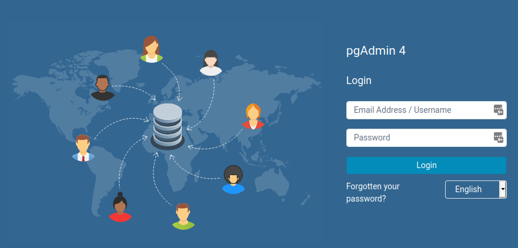
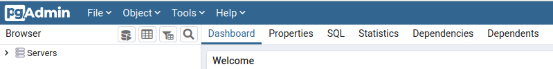
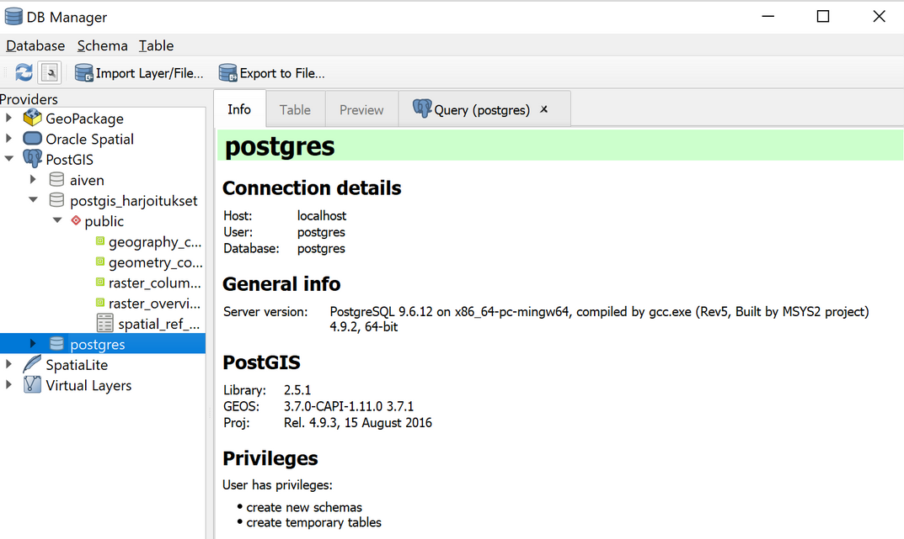
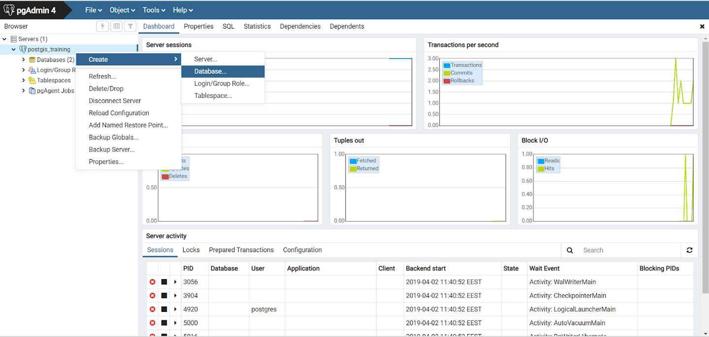
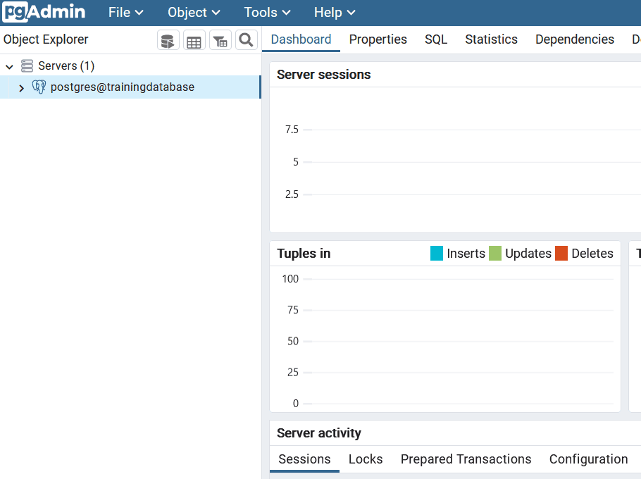
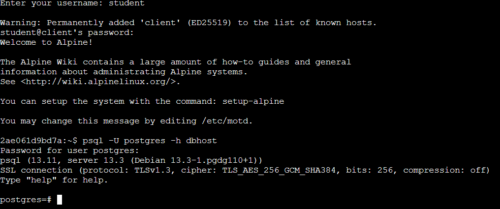
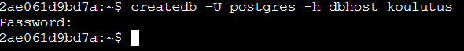

# Työkalujen käyttöönotto

**Harjoituksen sisältö** - Harjoituksessa tutustutaan pgAdmin 4 -käyttöliittymään sekä psql:ään. Lisäksi harjoituksessa luodaan uusi paikkatietokanta.

**Harjoituksen tavoite** - Harjoituksen jälkeen opiskelija hallitsee pgAdmin 4 -käyttöliittymän ja psql:n perusteet.

## pgAdmin 4

```{r include=FALSE}
pg_user <- Sys.getenv("PG_USER")
pg_pass <- Sys.getenv("PG_PASS")
pgadmin_email <- Sys.getenv("PGADMIN_EMAIL")
pgadmin_pass <- Sys.getenv("PGADMIN_PASSWORD")
linux_user <- Sys.getenv("LINUX_USER")
linux_pass <- Sys.getenv("LINUX_PASSWORD")
```

Käynnistä pgAdmin 4 -ohjelmisto menemällä osoitteeseen
[/pgadmin](/pgadmin). Pääset kirjautumaan etäpalvelimen pgAdminiin
seuraavilla tunnuksilla:

- Sähköpostiosoite: **`r pgadmin_email`**

- Salasana: **`r pgadmin_pass`**



### Tietokantayhteyden lisääminen

Liitä pgAdmin-ohjelmaan koulutusympäristön tietokanta klikkaamalla
hiiren oikealla kohdasta **Servers** ja valitsemalla **Register \>
Server...**

Syötä seuraavat tiedot:

- General-välilehdellä 
  - Name: yhteyden nimi (tyypillisesti \<käyttäjänimi\>\@\<tietokanta\>) 
  - Connection-välilehdellä
    - Host: **dbhost**
    - Port: **5432**
    - Maintenance database: **postgres**
    - Username: **`r pg_user`**
    - Password: **`r pg_pass`**
- Valitse **Save password**, jos et halua kirjoittaa salasanaa uudelleen aina avatessasi yhteyden

Voit tarkastella asennettua tietokantaa pgAdmin:n avulla yläpalkin eri
välilehdiltä:



PostGIS-tietokantoja voidaan hyödyntää pgAdmin:n lisäksi myös muissa
sovelluksissa (psql-komentorivin tai QGISin **Tietokannan hallinta (DB
Manager)** -lisäosan kautta). Tältä tietokanta näyttää QGISin
**Tietokannan hallinnassa**:



### Harjoitustietokannan luonti

Luodaan koulutusta varten **trainingdatabase**-niminen
harjoitustietokanta. Tämän voi tehdä pgAdmin:n **graafisen
käyttöliittymän** kautta:



:::hint-box
**Huom!** Tietokannan voi luoda ja poistaa myös seuraavien SQL-lauseiden avulla:

**CREATE DATABASE** trainingdatabase;\
**DROP DATABASE** trainingdatabase;

:::

### SQL-komentojen suorittaminen

Koulutuksessa tullaan suorittamaan useita harjoituksia SQL-komentokielen
avulla. pgAdmin:n **Kysely-työkalun (Query Tool)** avulla voit suorittaa
SQL-kyselyitä ja lausekkeita. **Query Tool** käynnistetään seuraavasti:

- Valitse **Servers**-osiosta oma tietokantaklusterisi
- Valitse klusterin sisältä haluamasi tietokanta (**trainingdatabase**) 
- Valitse ylhäältä **Tools \> Query Tool**

Haluttu SQL-komento suoritetaan painamalla avautuvasta **Query Tool**
-ikkunasta löytyvää kolmio-painiketta (**Execute/Refresh**) tai
**F5**-näppäintä. Jos haluat suorittaa vain osan SQL-lausekkeesta,
väritä hiirellä mieleisesi osio ja paina **F5**. Näet alaikkunassa
komennon tuloksen. Voit myös tallentaa SQL-komentosi
**.sql**-tiedostoon, josta ne voi myöhemmin ladata.



Nyt voidaan lisätä PostGIS-lisäosa **trainingdatabase**-tietokantaan
seuraavalla SQL-komennolla:

::: code-box
``` sql
CREATE EXTENSION IF NOT EXISTS postgis;
```
:::

::: hint-box
Mitä spatial_ref_sys-taulu sisältää?

Mitä näkymiä (views) on tietokantaan muodostunut? Mitä tietoja ne
sisältävät?
:::


## Psql-komentorivityökalu

SQL-komentoja voi suorittaa pgAdminin (ja QGISin Tietokannan hallinta
-lisäosan) lisäksi myös psql-komentorivin kautta. Avaa
[komentorivi](/wetty), jotta pääset käyttämään
psql-komentorivityökalua. Kirjaudu ensin sisään WeTTY- terminaaliemulaattoriin:

- Username: **`r linux_user`**
- Password: **`r linux_pass`**

Ota yhteys omaan tietokantaklusteriisi
komennolla:


::: commandline-box
``` sh
psql -U postgres -h dbhost
```
:::




### psql:n käyttäminen

Kun psql on käynnistetty, komentoriville voi kirjoittaa sekä psql- että
SQL-komentoja. psql-session aikana käytettäviä komentoja kutsutaan
psql-interaktiivisiksi.

Alla muutama esimerkki interaktiivisista psql-komennoista:

::: commandline-box
``` psql
\d = näytä taulut, näkymät ja sekvenssit
\dg = näytä tietokantaklusterin roolit (käyttäjät)
\c tietokannan_nimi = yhdistä tietokannan_nimi -tietokantaan
```
:::

Komennolla `help` ja erityisesti komennolla `\?` saat tietoa ohjelman
eri komennoista. Pääset pois listauksesta painamalla `q`.

Komentorivin puolella käytettäviä psql-komentoja kutsutaan
ei-interaktiivisiksi. Ei-interaktiivisia psql-komentoja käytetään
silloin kun halutaan käyttää psql:aa suoraan käyttöjärjestelmän
komentorivista ja valittavat psql-komennot sekä SQL-skriptit ovat
tiedostossa. Ei-interaktiivinen psql soveltuu erityisen hyvin tehtävien
automaatisointiin. Edellä mainitut yhteydenottokomennot ovat oivia
esimerkkejä ei-interaktiivisista psql-komennoista. Kokeile ajaa seuraava
komento komentorivillä:

::: commandline-box
``` sh
psql -U postgres -h dbhost -c "select current_database();"
```
:::

### Tietokannan luonti

createdb on komentorivityökalu helpottamaan tietokannan luomista.
Helpoimmillaan uuden tietokannan luominen onnistuukin komennolla:

::: commandline-box
``` sh
createdb -U postgres -h dbhost uuden_tietokannan_nimi
```
:::



### Tietokannan poistaminen

dropdb samoin kuin createdb on komentorivityökalu. Helpoimmillaan
tietokannan voi poistaa komennolla:

::: commandline-box
``` sh
dropdb -U postgres -h dbhost poistettavan_tietokannan_nimi
```
:::

### Tietokantayhteyden sulkeminen

Kun haluat sulkea tietokantayhteyden, anna psql-ohjelmassa komento:

::: commandline-box
`\q`
:::

### Tiedot asennuksista

PostgreSQL:n version voit kysyä SQL-komennolla:

::: code-box
``` sql
SELECT version();
```
:::

Asennetut lisäosat voit tarkistaa SQL-lauseella:

::: code-box
``` sql
SELECT *
FROM pg_extension;
```
:::
### Tietokantayhteyden sulkeminen

Klikkaa hiiren oikealla luomasi yhteyden päällä ja valitse **Disconnect
from server**.

### Muita huomioita

Jos haluat käyttää PostGIS-tietokantaa muilta tietokoneilta, tulee
PostgreSQL:n määrittelytiedostoon (pg_hba.conf) tehdä muutamia
tarvittavia muutoksia, esimerkiksi seuraavasti:

::: code-box
``` mysql
# IPv4 local connections:
#host  all     all      127.0.0.1/32      md5
host   all     all        0.0.0.0/0       trust
```
:::

Muutokset on tehty koulutuksessa käytettävälle PostgreSQL-asennukselle
jo valmiiksi.

::: hint-box
**HUOM!** Tämä muutos mahdollistaa yhteydenoton mistä tahansa tietokoneesta ja
on turvallisuusriski tuotannollisissa tietojärjestelmissä.
:::

Oletuksena yhteys tietokantaan on suojaamaton. Tietokantayhteys
suositellaan salattavaksi TLS:n avulla.
