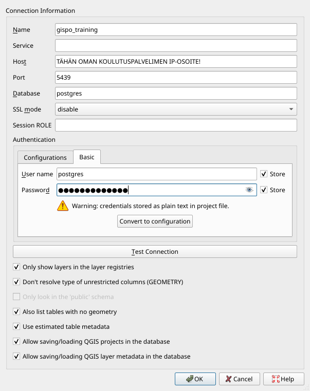
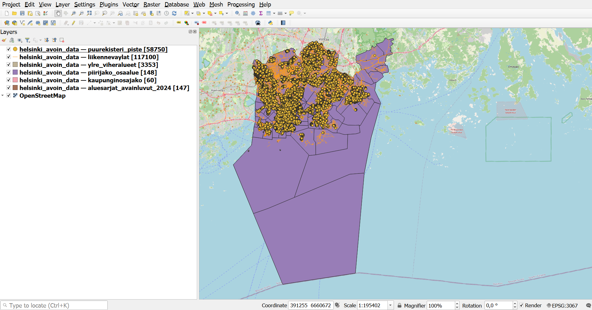
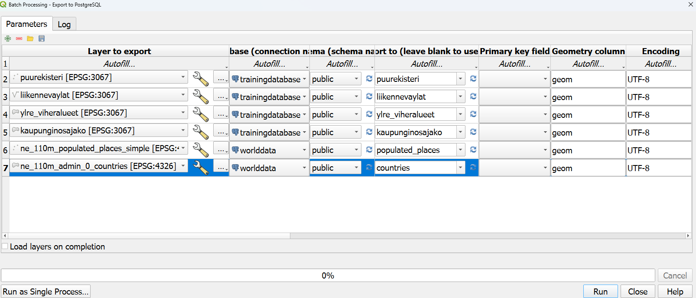

# Harjoitus 2: Aineistojen lataaminen

**Harjoituksen sisältö** - Harjoituksessa ladataan paikkatietoaineistoja PostGIS- tietokantaan.

**Harjoituksen tavoite** - Harjoituksen jälkeen opiskelijalla on perustiedot paikkatietoaineistojen lataamiseen paikkatietokantaan.

### Valmistautuminen

QGIS tulee olla asennettuna, jotta paikkatietoaineistoja voidaan ladata. Avaa myös [pgAdmin](/pgadmin) selaimeen ja kirjaudu sisään.  Avaa **Query Tool** (Valitse _trainingdatabase_ **->** Ylhäältä **Tools** **->** **Query Tool**).


## Harjoitus 2.1: Paikkatietoaineiston lataaminen

Harjoituksissa käytettävä Helsingin data-aineisto on ladattu valmiiksi harjoitussivun [data-kansioon](/data).

### Vaihtoehto 1: QGISin tietokannan hallinnan avulla

QGIS-työpöytäohjelmisto tarjoaa erittäin kätevän graafisen käyttöliittymän paikkatietoaineistojen lataamiseksi PostGIS-tietokantaan. Useat QGISin eri työkalut mahdollistavat joustavan latauksen ja mahdolliset muokkaukset aineistoon jo ennen latausta.

Ensimmäisessä vaiheessa otetaan yhteys lokaalista QGIS-asennuksesta koulutuksessa käytettävään PostGIS-tietokantaan. Avaa tässä vaiheessa QGIS, jos et ole sitä jo tehnyt. Lisää uusi tietokantayhteys avaamalla QGISin tietolähteiden hallinta klikkaamalla Tasot \> Tietolähteiden hallinta. Valitse Tietolähteiden hallinta -ikkunasta PostgreSQL-välilehti ja klikkaa Uusi-painiketta.

Syötä Yhteyden tiedot -ikkunaan seuraavat tiedot tietokantayhteyden määrittämiseksi:



Huomaa, että Name-kenttä kuvaa vain QGISiin tallennettavan yhteyden nimeä eikä itse tietokannan nimeä. Yhteyden valinnaisista toiminnallisuuksista kannattaa oletuksena valita kaikki. Esimerkiksi arvioidun metadatan käyttäminen nopeuttaa hakuja huomattavasti.

Paina **Testaa yhteyttä** -painiketta varmistaaksesi tietokantayhteyden toiminnan ja paina **OK**. QGISin sisällä voi myös ajaa SQL-komentoja esimerkiksi **DB Manager**in avulla.

Ota yhteys QGISista postgres-nimisen tietokannan lisäksi trainingdatabase-nimiseen tietokantaan, jossa tulemme operoimaan loppukurssin ajan. Tietokantayhteyden muodostaminen tapahtuu hyvin pitkälti samoin kuin yllä on kuvattu. Ainoastaan Name-kohtaan tulee syöttää jokin muu arvo (esim. gispo_trainingdatabase).


Lataa [data-kansio](/data/helsinki_avoin_data.zip) omalle koneellesi. Aineistoja voi lisätä navigoimalla Tasot \> Lisää taso \> Lisää vektoritaso, klikkaamalla Lisää vektoritaso -kuvaketta tasojen hallinnan työkalupalkista tai ihan vain raahaamalla tasoja suoraan Selain-ikkunasta Tasot-ikkunaan.

Lataa projektiisi ja tietokantoihisi seuraavat aineistot (käytä tietokanta-exportissa näitä nimiä tauluille, kts. alla):

Trainingdatabase:

- puurekisteri_piste

- liikennevaylat

- ylre_viheralueet

- kaupunginosajako


Worldatabase:

- populated_places

- countries


::: hint-box
Tarkista, että Koodaus-kohdassa on valittu UTF-8. Mikäli aineisto koodataan jollakin toisella järjestelmällä, ääkköset puuttuvat metatiedoista.
:::

QGIS-projektiin avautuu vektoriaineistoja, johon on määritelty tietty koordinaattijärjestelmä. Tarkista, että koordinaattijärjestelmäksi on määritelty ETRS89 / TM35FIN(E,N) (EPSG: 3067) tai EPSG:3047. Tason koordinaattijärjestelmän voit tarkistaa ja muuttaa klikkaamalla hiiren oikeaa painiketta tasolla ja valitsemalla **Ominaisuudet \> Lähde \> Aseta koordinaattijärjestelmä**.



Avaa QGISin prosessointityökaluista työkalu nimeltä Export to PostgreSQL (Processing Toolbox > Database > Export to PostgreSQL). 
Avaa työkalun alapalkista **Aja eräajona** (Run as Batch Process), joka mahdollistaa useamman taulun ajamiseen tietokantaan kerralla. 
Muuta parametreja niin, että aineistot tulee ladattua oikeaan skeemaan ja tietokantaan. Huomaa, että Helsingin datat ja Natural Earth -aineiston tasoa tulevat eri tietokantoihin
joten yhteyskin on niissä eri. **Täytä** (Fill Down) -toimintoa käyttämällä sinun ei tarvitse klikkailla jokaisen tason kohdalta arvoja kuntoon. 

Varmista taulujen nimien kirjaantumisen pienillä kirjaimilla, kirjoita taulun nimi määrittävään kohtaan taulun nimi kuten se annettiin edellä.

Tarkista mitä muita parametrejä prosessi pitää sisällään. Voit kuitenkin jättää ne oletusarvoisiksi. Lopulta latausprosessisi pitäisi näyttää kutakuinkin tältä. Klikkaa **Run**!

 Tarkista latauksen jälkeen, että aineistot ovat latautuneet. Tarkista virheilmoitukset ja korjaa latausta tarvittaessa.

::: code-box
``` sql
SELECT *
FROM kaupunginosajako
LIMIT 10;
```
:::

### Vaihtoehto 2: Komentorivin avulla

Luo tarvittaessa ensin harjoitustietokantaan uusi skeema, jonne Helsingin aineistot tullaan lataamaan, ja anna skeemalle nimeksi "helsinki". Skeemojen avulla on helpompi pitää aineistot järjestyksessä. Uuden skeeman voi luoda pgAdminin graafisen käyttöliittymän kautta tai seuraavalla SQL-komennolla:

::: code-box
``` sql
CREATE SCHEMA IF NOT EXISTS helsinki;
```
:::

Komentoriviltä tapahtuvaan lataamiseen käytetään **ogr2ogr**-työkalua. Käynnistämällä ohjelman ilman parametrejä saat opasteen eri parametreistä. Tämän jälkeen voit ladata aineistoa äsken luotuun skeemaan **ogr2ogr**-työkalulla. Jos koneellasi on asennettu OSGeo4W-paketti (tulee QGIS:n asennuksen mukana), avaa käynnistysvalikosta **OSGeo4W Shell** ja anna seuraava komento:

::: commandline-box
``` sh
ogr2ogr -f "PostgreSQL" "PG:host=<hostname>  dbname=<dbname> user=<kayttaja> password=<salasana>" <dir>\tiedostonimi.gpkg -lco SCHEMA=helsinki
```
:::

Muista tarkistaa, että aineiston hakemistopolku ja muut parametrit ovat kunnossa!

**ogr2ogr**-komennon käyttämät parametrit ovat:

::: commandline-box
```         
-f   output file format name
-lco layer creation option
```
:::

Muita parametreja voit tutkia suorittamalla **ogr2ogr**-komennon ilman parametrejä.