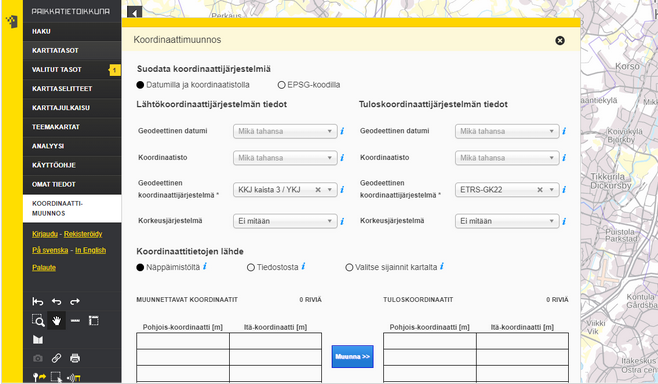

# Harjoitus 3: PostGIS-funktiot

**Harjoituksen sisältö** - Harjoituksessa tutustutaan eri PostGIS-funktioihin sekä geometry- ja geography-geometriakenttien eroihin ja käyttöön.

**Harjoituksen tavoite** - Harjoituksen tarkoituksena on tutustua PostGIS-laajennoksen sisältöön.

### Valmistautuminen

Avaa [pgAdmin](/pgadmin) selaimeen ja kirjaudu sisään.  Avaa **Query Tool** (Valitse _trainingdatabase_ **->** Ylhäältä **Tools** **->** **Query Tool**).

### Yksinkertaisia SQL-hakuja

## Harjoitus 3.1

## PostGISin perusfunktiot geometrioiden käsittelyyn

- dokumentaatio 

## PostGISin perusfunktiot geometrioiden määrittelyyn

-ST_AsWKT ja muut mahdolliset geometrioiden muodot: 
-- Käytetään ainakin lentokenttätasoa (tai myös liikennevaylat-tasoa tai puurekisteri) tehdään uusi geometria, johon geometria kopioidaan wkb_geometry-kentästä, mutta 
tallennetaan maantieteelliseen koordinaatistoon ja vaikka WKT-muodossa. (ei luoda indeksiä tässä)


- ST_Distance-funktio ja projisoidut sekä maantieteelliset koordinaatit
-- mistä saadaan PostGISsissä tietoa geometria-kentistä (sekä CRS:stä)
--lentokenttä-aineisto ja distance funktion vertailu (tässä voisi myös käyttää jo explain analyzeä)

## Spatiaaliset relaatiot

- Luodaan vaikka jo pohja kyselylle seuraavan harkan näkymiä varten


## ------------------------------------------------------

Seuraavaksi tutkitaan hiukan edellisessä harjoituksessa ladattuja paikkatietoaineistoja:

:::code-box
```sql
SELECT
--
FROM
--;
```
:::


<button onclick="toggleAnswer(this)" class="btn answer_btn">vinkki</button>

::: hidden-box
:::code-box
```sql
-- Täydennä tähän kyselyyn oikeat sarakkeet, skeema ja taulu. Tarkista millä funktiolla
-- saat laskettua keskiarvon. Käytä char_length() funktiota, jolla saat palautettua
-- merkkijonon pituuden.
SELECT
--
FROM
skeema.taulu
GROUP BY
--
ORDER BY
--
LIMIT 1;
```
:::
:::

<button onclick="toggleAnswer(this)" class="btn answer_btn">ratkaisu</button>

::: hidden-box
:::code-box
```sql
SELECT
maaku_ni1, avg(char_length(kunta_ni1))
FROM
nlsfi.hallintoalue
GROUP BY
maaku_ni1
ORDER BY
avg(char_length(kunta_ni1)) desc
LIMIT 1;
```
:::
:::

### Paikkatietojen metatiedot

Kaikki PostGIS-tietokannassa olevat paikkatietotaulut on rekisteröity metatieto-tauluihin:

|                                               |                                                             |
|:------------------------------:|:--------------------------------------:|
| [**geography_columns**]{style="color:purple"} |           Geography-tietotyypin paikkatietotaulut           |
| [**geometry_columns**]{style="color:purple"}  |           Geometry-tietotyypin paikkatietotaulut            |
|  [**raster_columns**]{style="color:purple"}   |         Rasteritietoa sisältävät paikkatietotaulut          |
| [**raster_overviews**]{style="color:purple"}  | Yleistettyjä rasteriaineistoja sisältävät paikkatietotaulut |

## Harjoitus 4.1: Geometrioiden metatiedot

Tutki geometry_columns-taulua. Mitä tietoja eri tietokentät sisältävät?

::: code-box
``` sql
SELECT *
FROM
geometry_columns;
```
:::

::: hint-box
Onko geometry_columns taulu?
:::

## Harjoitus 4.2: Geometrian esittäminen

Tarkastellaan ensin paikkatietojen tallennusmuotoa PostGIS-paikkatietokannassa. Suorita seuraava SQL-lause:

::: code-box
``` sql
SELECT
kunta_ni1, maaku_ni1, wkb_geometry
FROM
nlsfi.hallintoalue
WHERE
kunta_ni1 = 'Hanko';
```
:::

Tuloksesta nähdään, että sarakkeen wkb_geometry sisältö on koneluettavassa binäärimuodossa. 

::: hint-box
Vinkki: On mahdollista tarkastella geometrioita suoraan graafisessa käyttöliittymässä klikkaamalla pientä karttaikonia  geometriasarakkeen päällä. Mikäli aineistot ovat WGS84-koordinaattijärjestelmässä (EPSG: 4326), pgAdmin myös lisää niihin suoraan taustakartan OpenStreetMapista.
:::

Aineistojen koordinaatistot löytyvät SRID-sarakkeesta. Yhdessä SRID-sarakkeessa voi olla vain yhden koordinaatiston metatiedot. Koordinaatit voi muuntaa paremmin ihmisluettavaan tekstimuotoon seuraavalla hakulausekkeella:

::: code-box
``` sql
SELECT
kunta_ni1, maaku_ni1, ST_AsText(wkb_geometry)
FROM
nlsfi.hallintoalue
WHERE
kunta_ni1 = 'Hanko';
```
:::

## Harjoitus 4.3: Funktiot

Kokeile myös seuraavia funktioita Hangon kunnan geometriatietoihin liittyen:

-   ST_Boundary

::: code-box
``` sql
SELECT
...
FROM
...
WHERE
...;
```
:::

<button onclick="toggleAnswer(this)" class="btn answer_btn">vinkki</button>

::: hidden-box
:::code-box
```sql
SELECT
kunta_ni1, maaku_ni1, ST_Boundary() -- valitse funktioon geometria- sarake
FROM
skeema.taulu
WHERE
...; -- valitse Hangon kunta nimen perusteella.
```
:::
:::

<button onclick="toggleAnswer(this)" class="btn answer_btn">ratkaisu</button>

::: hidden-box
::: code-box
``` sql
SELECT
kunta_ni1, maaku_ni1, ST_Boundary(wkb_geometry)
FROM
nlsfi.hallintoalue
WHERE
kunta_ni1 = 'Hanko';
```
:::
:::

-   ST_Centroid

::: code-box
``` sql
SELECT
...
FROM
...
WHERE
...;
```
:::

<button onclick="toggleAnswer(this)" class="btn answer_btn">vinkki</button>

::: hidden-box
:::code-box
```sql
kunta_ni1, maaku_ni1, ST_Centroid() -- valitse funktioon geometria- sarake
FROM
skeema.taulu
WHERE
...; -- valitse Hangon kunta nimen perusteella.
```
:::
:::

<button onclick="toggleAnswer(this)" class="btn answer_btn">ratkaisu</button>


::: hidden-box
::: code-box
``` sql
SELECT
kunta_ni1, maaku_ni1, ST_Centroid(wkb_geometry)
FROM
nlsfi.hallintoalue
WHERE
kunta_ni1 = 'Hanko';
```
:::
:::

-   ST_Envelope

::: code-box
``` sql
SELECT
...
FROM
...
WHERE
...;
```
:::

<button onclick="toggleAnswer(this)" class="btn answer_btn">vinkki</button>

::: hidden-box
:::code-box
```sql
kunta_ni1, maaku_ni1, ST_Envelope() -- valitse funktioon geometria- sarake
FROM
skeema.taulu
WHERE
...; -- valitse Hangon kunta nimen perusteella.
```
:::
:::

<button onclick="toggleAnswer(this)" class="btn answer_btn">ratkaisu</button>

::: hidden-box
::: code-box
``` sql
SELECT
kunta_ni1, maaku_ni1, ST_Envelope(wkb_geometry)
FROM
nlsfi.hallintoalue
WHERE
kunta_ni1 = 'Hanko';
```
:::
:::

Huomaa, miten vastauksena tuleva geometrian tyyppi vaihtelee eri funktioiden kohdalla.


### Käytettäviä funktioita

Tässä harjoituksessa hyödynnetään ainakin näitä funktioita:

| PostGIS-funktio | Toiminta |
|:--: | :---: |
| ST_Contains(geometry A, geometry B) | Palauttaa "TOSI", jos A sisältää B:n |
| ST_Crosses(geometry A, geometry B) | Palauttaa "TOSI", jos A leikkaa B:tä |
| ST_Disjoint(geometry A , geometry B) | Palauttaa "TOSI", jos geometriat eivät leikkaa toisiaan |
| ST_Distance(geometry A, geometry B) | Palauttaa geometrioiden välisen minimietäisyyden |
| ST_DWithin(geometry A, geometry B, radius) | Palauttaa "TOSI", jos A on lähempänä B:tä kuin annettua etäisyyttä |
| ST_Equals(geometry A, geometry B) | Palauttaa "TOSI", jos A on sama kuin B |
| ST_Intersects(geometry A, geometry B) | Palauttaa "TOSI", jos A leikkaa B:tä |
| ST_Overlaps(geometry A, geometry B) | Palauttaa "TOSI", jos A ja B ovat päällekkäin, mutteivät kuitenkaan toistensa sisäpuolella |
| ST_Touches(geometry A, geometry B) | Palauttaa "TOSI", jos A:n reuna koskettaa B:tä |
| ST_Within(geometry A, geometry B) | Palauttaa "TOSI", jos A on B:n sisäpuolella |

## Harjoitus 6.1

Etsitään ne kunnat, joissa on lentokenttä:

:::code-box
```sql
SELECT
a.kunta_ni1
FROM 
nlsfi.hallintoalue a, nlsfi.lentokenttapiste b
WHERE
ST_Contains(a.wkb_geometry, b.wkb_geometry);
```
:::

Huomaa kuinka kirjaimia a ja b käytetään kyselyssä aliaksina, eli sarakkeiden korvaavina niminä. Aliasten käyttö helpottaa varsinkin pitkien kyselyiden tulkitsemista ja kirjoittamista. Voit lukea lisää aliaksista esimerkiksi täältä: [postgresql-alias](https://www.postgresqltutorial.com/postgresql-alias/).

Montako lentokenttää Suomessa on?

:::code-box
```sql
SELECT
...
FROM
...
```
:::

<button onclick="toggleAnswer(this)" class="btn answer_btn">vinkki</button>

::: hidden-box
:::code-box
```sql
-- Millä funktiolla voit laskea tietueiden määrän?
SELECT
funktio(id)
FROM
nlsfi.taulu;
-- Täydennä oikea taulu
```
:::
:::

<button onclick="toggleAnswer(this)" class="btn answer_btn">ratkaisu</button>

:::hidden-box
:::code-box
```sql
SELECT
count(ogc_fid)
FROM
nlsfi.lentokenttapiste;
```
:::
:::

Jos lisäät SELECT-komentoon parametrin DISTINCT, saat selville kuinka monta lentokentällistä kuntaa Suomessa on.

:::code-box
```sql
SELECT

FROM
(SELECT DISTINCT

FROM

WHERE
ST_Contains(..., ...));
```
:::

<button onclick="toggleAnswer(this)" class="btn answer_btn">vinkki</button>

::: hidden-box
:::code-box
```sql
-- käytä sisäkkäistä kyselyä
-- sisäkkäiselle kyselyllä annetaan alias
SELECT
funktio(kunta_distinct)
FROM
(SELECT DISTINCT
a.kunta_ni1 as kunta_distinct
FROM
nlsfi.hallintoalue a, nlsfi.lentokenttapiste b
WHERE
sisältää(... , ... )) as ...;
-- Millä PostGIS- funktiolla voit tarkastaa onko geometria b geometrian a sisällä?
```
:::
:::

<button onclick="toggleAnswer(this)" class="btn answer_btn">ratkaisu</button>

:::hidden-box
:::code-box
```sql
SELECT
count(kunta_distinct)
FROM
(SELECT DISTINCT
a.kunta_ni1 as kunta_distinct
FROM
nlsfi.hallintoalue a, nlsfi.lentokenttapiste b
WHERE
ST_Contains(a.wkb_geometry, b.wkb_geometry)) as DistincKunta;
```
:::
:::

## Harjoitus 6.2

Missä Suomen kunnissa on kaksi lentokenttää?

:::code-box
```sql
SELECT ...
```
:::

<button onclick="toggleAnswer(this)" class="btn answer_btn">vinkki</button>

::: hidden-box
:::code-box
```sql
-- Vaihtoehto 1
-- Käytä CTE:tä
WITH apm AS (
SELECT DISTINCT
a.kunta_ni1, COUNT(...) OVER(PARTITION BY ...) AS CountAirports
FROM
nlsfi.hallintoalue a, nlsfi.lentokenttapiste b
WHERE
sisältää(a.wkb_geometry, b.wkb_geometry)
ORDER BY
CountAirports DESC
)

-- tarkastele tuloksia:

SELECT
kunta_ni1 as "Municipality", countairports AS "Count of Airports"
FROM
apm
WHERE
CountAirports = 2;
```
:::

:::code-box
```sql
-- Vaihtoehto 2
SELECT 
a.kunta_ni1 as "Kunta", count(...) as "Lkm"
FROM
nlsfi.hallintoalue a, nlsfi.lentokenttapiste b
WHERE
sisältää(a.wkb_geometry, b.wkb_geometry)
GROUP BY
a.kunta_ni1
HAVING count(...) = ...;

-- täydennä tyhjät kohdat. Valitse oikea PostGIS- funktio
```
:::
:::

Perusteellinen ratkaisuvaihtoehto:

<button onclick="toggleAnswer(this)" class="btn answer_btn">ratkaisu</button>

:::hidden-box
:::code-box
```sql
WITH apm AS (
SELECT DISTINCT
a.kunta_ni1, COUNT(a.kunta_ni1) OVER(PARTITION BY a.kunta_ni1) AS CountAirports
FROM
nlsfi.hallintoalue a, nlsfi.lentokenttapiste b
WHERE
ST_Contains(a.wkb_geometry, b.wkb_geometry)
ORDER BY
CountAirports DESC
)

SELECT
kunta_ni1 as "Municipality", countairports AS "Count of Airports"
FROM
apm
WHERE
CountAirports = 2;
```
:::
:::

Pelkistetympi ratkaisuvaihtoehto:

<button onclick="toggleAnswer(this)" class="btn answer_btn">ratkaisu</button>

:::hidden-box
:::code-box
```sql
SELECT 
a.kunta_ni1 as "Kunta", count(*) as "Lkm"
FROM
nlsfi.hallintoalue a, nlsfi.lentokenttapiste b
WHERE
ST_Contains(a.wkb_geometry, b.wkb_geometry)
GROUP BY
a.kunta_ni1
HAVING count(*) = 2;
```
:::
:::

Suorita ao. SQL-lause. Mitä sillä saadaan selville?

:::code-box
```sql
SELECT
ST_ASText(a.wkb_geometry), a.ogc_fid
FROM
nlsfi.lentokenttapiste a, nlsfi.lentokenttapiste b
WHERE
ST_Equals(a.wkb_geometry,b.wkb_geometry) AND a.ogc_fid <> b.ogc_fid;
```
:::

<button onclick="toggleAnswer(this)" class="btn answer_btn">ratkaisu</button>

:::hidden-box
SQL- kysely palauttaa ne tietueet, joiden geometria on identtinen, mutta id eri.
:::

## Harjoitus 6.3
Etsitään ne kunnat, joissa ei ole rautatietä:

:::code-box
```sql
SELECT 
b.kunta_ni1
FROM
(SELECT
 ST_union(wkb_geometry) as wkb_geometry
 FROM
 nlsfi.rautatieviiva) as a, nlsfi.hallintoalue b
WHERE
ST_Disjoint(a.wkb_geometry, b.wkb_geometry);
```
:::
## Harjoitus 6.4
Etsitään kolme lähintä lentokenttää.

K Nearest Neighbours -menetelmällä (KNN) voidaan hakea kolme lähimpänä jonkin kunnan keskustaa sijaitsevaa lentokenttää.

:::code-box
```sql
WITH forssa AS
(SELECT
 wkb_geometry
 FROM
 nlsfi.hallintoalue
 WHERE
 kunta_ni1 = 'Forssa')  

SELECT
*, round(ST_Distance(forssa.wkb_geometry, a.wkb_geometry)/1000) as "km"
FROM 
nlsfi.lentokenttapiste a, forssa
ORDER BY
forssa.wkb_geometry <-> a.wkb_geometry
LIMIT 3;
```
:::

Sama ongelma voidaan ratkaista myös ilman KNN-algoritmia:

:::code-box
```sql
SELECT
*, round(ST_Distance(wkb_geometry,(
    SELECT ST_Centroid(wkb_geometry)
    FROM
    nlsfi.hallintoalue
    WHERE
    kunta_ni1 ='Forssa'))/1000) as etaisyys
FROM
nlsfi.lentokenttapiste 
ORDER by
etaisyys
LIMIT 3;
```
:::

Miksi saadut tulokset poikkeavat toisistaan?

## Harjoitus 6.5
Mitkä ovat Kuopion naapurikunnat?

:::code-box
```sql
SELECT
b.kunta_ni1
FROM
(SELECT
 kunta_ni1, wkb_geometry
 FROM
 nlsfi.hallintoalue
 WHERE
 kunta_ni1 = 'Kuopio') a, nlsfi.hallintoalue b
WHERE
ST_Touches(a.wkb_geometry, b.wkb_geometry);
```
:::

## Harjoitus 6.6
Etsitään ne tieviivat, jotka leikkaavat kuntarajoja:

:::code-box
```sql
SELECT
a.tienumero, a.wkb_geometry
FROM
nlsfi.tieviiva a, nlsfi.hallintoalue b
WHERE
ST_Crosses(a.wkb_geometry, b.wkb_geometry);
```
:::

Tulosten visualisoimiseksi, voit muodostaa **uuden skeeman** (tmp). Voit luoda uuden taulun, johon viet tuloksen. Visualisointiin voit käyttää esimerkiksi QGIS-ohjelmistoa. Voit muodostaa tuloksesta myös näkymän (view), mutta muista kuitenkin lisätä mukaan **yksilöivä tunnus** (id) sekä myös **DISTINCT**, jotta yksilöivät tunnukset pysyvät yksilöivinä.

:::code-box
```sql
CREATE SCHEMA IF NOT EXISTS tmp;
```
:::

:::code-box
```sql
DROP TABLE IF EXISTS tmp.crossroads;

CREATE TABLE tmp.crossroads AS
(
    SELECT
    a.tienumero, a.wkb_geometry
    FROM
    nlsfi.tieviiva a, nlsfi.hallintoalue b
    WHERE
    ST_Crosses(a.wkb_geometry, b.wkb_geometry)
);
```
:::

:::code-box
```sql
DROP VIEW IF EXISTS tmp.view_crossroads;

CREATE VIEW tmp.view_crossroads AS
(
    SELECT DISTINCT
    a.tienumero, a.wkb_geometry, a.ogc_fid
    FROM
    nlsfi.tieviiva a, nlsfi.hallintoalue b
    WHERE
    ST_Crosses(a.wkb_geometry, b.wkb_geometry)
);
```
:::

Kumman luominen oli nopeampaa: taulun vai näkymän?

:::hint-box
Entä käyttö QGISissä? Miksi?
:::

## Harjoitus 6.7
Lasketaan minimietäisyydet lentoasemilta lähimmälle rautatielle:

:::code-box
```sql
SELECT
a.ogc_fid, MIN(ST_Distance(a.wkb_geometry, b.wkb_geometry)) as "dist"
FROM
nlsfi.lentokenttapiste a, nlsfi.rautatieviiva b
GROUP BY
a.ogc_fid 
ORDER BY
dist;
```
:::


### Käytettäviä funktioita

Tässä harjoituksessa koordinaattien konversioihin ja muunnoksiin voidaan käyttää mm. seuraavia funktioita:

| PostGIS-funktio | Toiminta |
|:--: | :---: |
| ST_GeomFromText(text WKT, integer srid) | Palauttaa ST_Geometry-olion WKT-muotoisesta esitystavasta annetulla EPSG:llä |
| ST_AsText(geometry g) | Palauttaa ST_Geometry-olion määrityksen selväkielisessä WKT-muodossa |
| ST_Transform(geometry g1, integer srid) | Palauttaa geometrian muunnettuna parametrina annetun EPSG:n mukaiseen koordinaattijärjestelmään |
| ST_Transform(geometry geom, text to_proj) | Palauttaa geometrian muunnettuna parametrina PROJ.4-muodossa annettuun järjestelmään |
| ST_Transform(geometry geom, text from_proj, text to_proj) | Palauttaa geometrian muunnettuna PROJ.4-muodossa annetuista järjestelmistä toiseen |
| ST_Transform(geometry geom, text from_proj, integer to_srid) | Palauttaa geometrian muunnettuna PROJ.4-muodossa annetusta järjestelmästä annetun EPSG:n mukaiseen koordinaattijärjestelmään |

## Harjoitus 7.1: Koordinaattipisteen konversio

Muodosta maantieteellisistä ETRS89-koordinaateista (EPSG:4258) 24.3953148 (pituusaste) ja 60.2174696 (leveysaste) Kallion kirkkoa vastaava PostGISin koordinaattipiste:

:::code-box
```sql
SELECT
ST_GeomFromText('POINT(24.3953148 60.2174696)', 4258);
```
:::

## Harjoitus 7.2: Koordinaattimuunnos

Tee Kallion kirkon koordinaatteille konversio ETRS-TM35FIN-koordinaattijärjestelmään (EPSG:3067) hyödyntämällä **ST_Transform**-funktiota.

:::code-box
```sql
SELECT
...
```
:::

<button onclick="toggleAnswer(this)" class="btn answer_btn">vinkki</button>

::: hidden-box
:::code-box
```sql
-- täydennä oikeat funktiot vinkkien perusteella.
-- täydennä lähto- ja tavoitekoordinaattijärjestelmät '...'- kohtiin
SELECT
geometria_tekstinä(koordinaattimuunnos(luo_geometria_tekstistä('POINT(24.3953148 60.2174696)', ...), ...));
```
:::
:::

<button onclick="toggleAnswer(this)" class="btn answer_btn">ratkaisu</button>

:::hidden-box
:::code-box
```sql
SELECT
ST_asText(ST_Transform(ST_GeomFromText('POINT(24.3953148 60.2174696)', 4258), 3067));
```
:::
:::

Tuloksena pitäisi tulla seuraavat koordinaattipisteet EPSG:3067-koordinaattijärjestelmässä:

:::code-box
```
0101000020FB0B0000BE87BABAC1B515411865678EF3795941
```
:::
tai selväkielisemmin:

:::code-box
```
POINT(355696.43235218147 6678478.225060724)
```
:::

## Harjoitus 7.3: Koordinaattimuunnosten vertailu

Tee seuraavaksi Kallion kirkon koordinaateille muunnos **KKJ2**-koordinaattijärjestelmään (EPSG:2392).

:::code-box
```sql
SELECT
...
```
:::

<button onclick="toggleAnswer(this)" class="btn answer_btn">vinkki</button>

::: hidden-box
:::code-box
```sql
-- täydennä oikeat funktiot vinkkien perusteella.
-- täydennä lähto- ja tavoitekoordinaattijärjestelmät '...'- kohtiin
SELECT
geometria_tekstinä(koordinaattimuunnos(luo_geometria_tekstistä('POINT(24.3953148 60.2174696)', ...), ...));
```
:::
:::

<button onclick="toggleAnswer(this)" class="btn answer_btn">ratkaisu</button>

:::hidden-box
:::code-box
```sql
SELECT
ST_asText(ST_Transform(ST_GeomFromText('POINT(24.3953148 60.2174696)', 4258), 2392));
```
:::
:::

Tuloksen pitäisi olla:

:::code-box
```
POINT(6678507.76432921 2522091.992364572)
```
:::

Vertaa saatuja koordinaattiarvoja Maanmittauslaitoksen ylläpitämän [koordinaattimuunnospalvelun](https://kartta.paikkatietoikkuna.fi/) koordinaatteihin. Koordinaattimuunnostoiminto löytyy **Paikkatietoikkunan** vasemman reunan valikosta nimellä **Koordinaattimuunnos**.



Huomaa, että EPSG:4258- ja EPSG:3067-koordinaattijärjestelmien välillä tehtiin koordinaattikonversio, eikä PostGIS:n ja MML:n laskennassa ole oleellista eroa.

Tehdään koordinaattimuunnos EPSG:4258- ja EPSG:2392-koordinaattijärjestelmien välillä. Ero PostGISin ja Maanmittauslaitoksen laskemien koordinaattien välillä on merkittävämpi:

| PostGIS | MML | Erotus (m) |
| :--: | :---: | :---: |
| 6,678,  507.764333 | 6,678,  507.677300 | 0.087033 |
| 2,522,  091.992365 | 2,522,  091.368400 | 0.623965 |
\

:::hint-box
Mistä koordinaattimuunnoksen ero voi johtua?
:::

### Koordinaattijärjestelmien määritykset

Koordinaattijärjestelmien kuvaukset löytyvät **spatial_ref_sys**–taulusta:


:::code-box
```sql
SELECT
srid, proj4text
FROM
spatial_ref_sys
WHERE
srid = 2392;
```
:::

Tallennetut muunnosparametrit EUREF-FIN-datumin ja KKJ-datumin välillä antavat maksimissaan kahden metrin virheen Suomen alueella (kuva JHS 197-suosituksesta):


#### Puuttuvia koordinaattijärjestelmiä

EUREF-FIN -pohjaisten koordinaattijärjestelmien käyttöönotossa on EPSG-tietokantaan tuotettu erilaisia versioita ns. GK-koordinaattijärjestelmistä.

## Harjoitus 7.4: Koordinaattijärjestelmien määrittelyt

Tarkista mitkä määrittelyt koulutuksessa käytettävässä tietokannassa on ETRS-GK24FIN -koordinaattijärjestelmälle.

Tutki ensin spatial_ref_sys-taulun kenttiä. Päättele mistä kentästä voi löytyä tiedot koordinaattijärjestelmän tiedoista. Käytä LIKE-operaattoria.

:::code-box
```sql
SELECT ...
FROM
...
WHERE
...
```
:::

<button onclick="toggleAnswer(this)" class="btn answer_btn">vinkki</button>

::: hidden-box
:::code-box
```sql
SELECT *
FROM
spatial_ref_sys
WHERE
"srtext" LIKE '...';
-- täydennä '...' kohtaan arvo siten, että kysely palauttaa
-- ETRS-GK24FIN- koordinaattijärjestelmän määritelmän.
```
:::
:::

<button onclick="toggleAnswer(this)" class="btn answer_btn">ratkaisu</button>

:::hidden-box
:::code-box
```sql
SELECT *
FROM
spatial_ref_sys
WHERE
"srtext" LIKE '%ETRS-GK24FIN%';
```
:::
:::

## Harjoitus 7.5: Koordinaattijärjestelmien vertailu

Mitä eroja on EPSG:3131- ja EPSG:3879-koordinaattijärjestelmillä?

:::code-box
```sql
SELECT
...
FROM
...
WHERE
...
```
:::

<button onclick="toggleAnswer(this)" class="btn answer_btn">vinkki</button>

::: hidden-box
:::code-box
```sql
-- Missä sarakkeessa on EPSG- koodit?
SELECT
..., proj4text
FROM
spatial_ref_sys
WHERE
... in (3132, 3879);
-- Valitse EPSG-koodin perusteella
```
:::
:::

<button onclick="toggleAnswer(this)" class="btn answer_btn">ratkaisu</button>

:::hidden-box
:::code-box
```sql
SELECT
srid, proj4text
FROM
spatial_ref_sys
WHERE
srid in (3132, 3879);
```
:::
:::

## Harjoitus 7.6: Uuden paikkatietotaulun luominen

Luodaan tietokantaan uusi paikkatietotaulu, jossa on geometria-kenttä, jonka koordinaattijärjestelmä on WGS84. Luodaan tauluun neljä kenttää (gid, name, ICAO, geom):

:::code-box
```sql
DROP TABLE IF EXISTS air_geom;

CREATE TABLE air_geom
(
    gid    serial PRIMARY KEY,
    name    varchar(254),
    ICAO    varchar(254),
    geom    geometry(Point,4326)
);
```
:::

Luetaan airports-taulusta tiedot uuden taulun kenttiin. Muodostetaan ensin SELECT-lauseke, niin voidaan varmistua, että tietojen sisäänluku onnistuu.

:::code-box
```sql
INSERT INTO
air_geom(geom, name, ICAO)
SELECT
ST_GeomFromText('POINT(' || airports.longitude|| ' ' || airports.latitude||')',4326),
airports.name, airports.icao_code
FROM
airports;
```
:::

Kahdella putkimerkillä ```||``` yhdistetään tekstiä.

## Harjoitus 7.7: Toisen geometriakentän lisääminen

Lisätään vielä tehtyyn tauluun toinen geometria-kenttä, jonka koordinaattijärjestelmä on EPSG:3857:

:::code-box
```sql
ALTER TABLE
air_geom
ADD COLUMN
geom3857 geometry(Point,3857);
```
:::

## Harjoitus 7.8: Muunnoksen tallennus geometriakenttään

Luodaan uuteen geometria-kenttään uudet koordinaattipisteet airports-taulusta:

:::code-box
```sql
UPDATE
air_geom
SET
geom3857 = ST_Transform(geom, 3857);
```
:::

Jos komennon ajo ei mene läpi, kuinka ratkaisisit ongelman?


Tutustu lentokenttäaineistoon ja etsi virheilmoituksen tuottavat tietue. Kannattaa tutkia minkä alueen kuvaamiseen EPSG:3857-koordinaattijärjestelmä on suunnattu esimerkiksi [täältä](https://epsg.io/3857).

:::code-box
```sql
SELECT ...
FROM
...
WHERE
...
```
:::

<button onclick="toggleAnswer(this)" class="btn answer_btn">vinkki</button>

::: hidden-box
:::code-box
```sql
SELECT *
FROM
air_geom
WHERE
y-koordinaatti(geom) < ...;
-- Millä PostGIS- funktiolla saat palautettua y- koordinaatin?
-- täydennä sopiva arvo '...'- kohtaan.
```
:::
:::

<button onclick="toggleAnswer(this)" class="btn answer_btn">ratkaisu</button>

:::hidden-box
:::code-box
```sql
SELECT *
FROM
air_geom
WHERE
ST_Y(geom) < -85.06;
```
:::
:::

Paikannattuasi ongelman, korjaa se (jätä ongelman aiheuttava lentokenttä air_geom-taulun kentän päivityskomennon ulkopuolelle).

:::code-box
```sql
SELECT gid,name,icao,ST_asText(geom)
FROM air_geom
WHERE ST_Y(geom) = -90;
```
:::

<button onclick="toggleAnswer(this)" class="btn answer_btn">vinkki</button>

::: hidden-box
:::code-box
```sql
UPDATE air_geom
SET geom3857 = ST_Transform(geom,3857)
WHERE ...;
-- karsi ongelman aiheuttava tietue pois
```
:::
:::

<button onclick="toggleAnswer(this)" class="btn answer_btn">ratkaisu</button>

:::hidden-box
:::code-box
```sql
SELECT gid,name,icao,ST_asText(geom)
FROM air_geom
WHERE ST_Y(geom) = -90;
```
:::
:::code-box
```sql
UPDATE air_geom
SET geom3857 = ST_Transform(geom,3857)
WHERE icao != 'NZSP';
```
:::
:::

Ratkaistuasi ongelman, tarkista tulos QGIS-ohjelmiston avulla.


Kirjoitetaan yhdessä **SQL-terminaaliin** seuraava komento:

:::code-box
```sql
SELECT
ST_Centroid(wkb_geometry) as "Centroids of first 10"
FROM
nlsfi.hallintoalue
LIMIT 10;
```
:::

Komento tuottaa kymmenen ensimmäisen alueen keskipisteet.

## Harjoitus 8.2: Keskipisteiden määritys

Ovatko kaikki keskipisteet alueiden sisäpuolella? Kuinka monta pistettä jää ulkopuolelle?

:::code-box
```sql
SELECT ...
```
:::

Huomaa, että saat selville vastauksen myös tulostamalla kaikkien sellaisten kuntien nimet, joiden keskipiste jää alueen ulkopuolelle ja laskemalla tulostaulukon rivien lukumäärän.

<button onclick="toggleAnswer(this)" class="btn answer_btn">vinkki</button>

::: hidden-box
:::code-box
```sql
-- vaihtoehto 1 ST_Contains- funktiolla
-- CTE:llä
WITH notin AS(
    SELECT
    ...
    FROM
    ...
    WHERE
    NOT ...

SELECT
count(...)
FROM
notin;
```
:::

:::code-box
```sql
-- vaihtoehto 2 - ST_Within- funktiolla
SELECT
...
FROM
...
WHERE
NOT ...;
```
:::
:::

Ratkaisuvaihtoehto 1 (käytetään **ST_Contains**-funktiota):

<button onclick="toggleAnswer(this)" class="btn answer_btn">ratkaisu</button>

:::hidden-box
:::code-box
```sql
WITH notin AS(
    SELECT
    kunta_ni1 as "withST_Contains"
    FROM
    nlsfi.hallintoalue
    WHERE
    NOT ST_Contains(wkb_geometry, ST_Centroid(wkb_geometry)))

SELECT
count(notin."withST_Contains")
FROM
notin;
```
:::
:::

Ratkaisuvaihtoehto 2 (käytetään **ST_Within**-funktiota):

<button onclick="toggleAnswer(this)" class="btn answer_btn">ratkaisu</button>

:::hidden-box
:::code-box
```sql
SELECT
kunta_ni1 as "with ST_Within"
FROM
nlsfi.hallintoalue
WHERE
NOT ST_Within(ST_Centroid(wkb_geometry), wkb_geometry);
```
:::
:::

## Harjoitus 8.3: Etäisyydet

Miten paljon harjoituksessa 8.2 löydettyjen kuntien painokeskipisteet eroavat **ST_PointOnSurface**–funktion pisteistä?

:::code-box
```sql
SELECT
...
FROM
...
WHERE
NOT ...;
```
:::

<button onclick="toggleAnswer(this)" class="btn answer_btn">vinkki</button>

::: hidden-box
:::code-box
```sql
-- Millä PostGIS- funktiolla voit laskea etäisyyden pisteiden välillä?
SELECT
kunta_ni1 as "Kunta",
round(etäisyys(ST_PointOnSurface(wkb_geometry), ST_centroid(wkb_geometry)))
as "Distance PntOnSurface and Centroid"
FROM
nlsfi.hallintoalue
WHERE
NOT ...;
-- rajaa pois pisteet, jotka ei ole polygonin sisällä.
```
:::
:::

<button onclick="toggleAnswer(this)" class="btn answer_btn">ratkaisu</button>

:::hidden-box
:::code-box
```sql
SELECT
kunta_ni1 as "Kunta",
round(ST_Distance(ST_PointOnSurface(wkb_geometry), ST_centroid(wkb_geometry)))
as "Distance PntOnSurface and Centroid"
FROM
nlsfi.hallintoalue
WHERE
NOT ST_Within(ST_Centroid(wkb_geometry), wkb_geometry);
```
:::
:::

## Harjoitus 8.4: Vyöhykkeet

Muodostetaan tiestölle vyöhyke:

:::code-box
```sql
SELECT
ogc_fid, ST_Buffer(wkb_geometry, 100) as geom
FROM
nlsfi.tieviiva
WHERE
tienumero = 66;
```
:::

Muodosta vyöhykkeestä näkymä ja visualisoi se QGISissä. Voit myös muodostaa useamman vyöhykkeen eri etäisyyksille.

:::code-box
```sql
DROP VIEW IF EXISTS nlsfi.view_road_buffer;

CREATE VIEW nlsfi.view_roadbuffed AS (
    WITH buffers AS (
        ...
        UNION
        ...
    )
    SELECT
    row_number() OVER() AS vid, geom, buffer
    FROM
    buffers
);
```
:::

<button onclick="toggleAnswer(this)" class="btn answer_btn">vinkki</button>

::: hidden-box
:::code-box
```sql
DROP VIEW IF EXISTS nlsfi.view_roadbuffer;

CREATE VIEW nlsfi.view_roadbuffer AS (
    WITH buffers AS (
        SELECT
        ..., 100 as buffer -- täydennä ST_Buffer funktio
        FROM
        nlsfi.tieviiva
        WHERE
        ... -- valitse tienumeron 66 mukaan
        UNION
        SELECT
        ..., 250 as buffer -- täydennä ST_Buffer funktio
        FROM
        nlsfi.tieviiva
        WHERE -- valitse tienumeron 66 mukaan
        ...
    )
    SELECT
    row_number() OVER() AS vid, geom, buffer
    FROM
    buffers
);
```
:::
:::

<button onclick="toggleAnswer(this)" class="btn answer_btn">ratkaisu</button>

:::hidden-box
:::code-box
```sql
DROP VIEW IF EXISTS nlsfi.view_roadbuffer;

CREATE VIEW nlsfi.view_roadbuffer AS (
    WITH buffers AS (
        SELECT
        ST_Buffer(wkb_geometry, 100) as geom, 100 as buffer
        FROM
        nlsfi.tieviiva
        WHERE
        tienumero = 66
        UNION
        SELECT
        ST_Buffer(wkb_geometry, 250) as geom, 250 as buffer
        FROM
        nlsfi.tieviiva
        WHERE
        tienumero = 66
    )
    SELECT
    row_number() OVER() AS vid, geom, buffer
    FROM
    buffers
);
```
:::
:::

> Editoi alkuperäistä tieviivaa QGIS:ssä.
