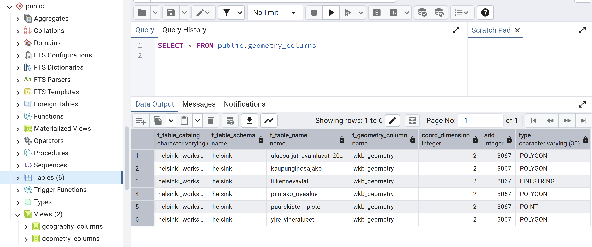

# Harjoitus 3: PostGIS-funktiot

**Harjoituksen sisältö** - Harjoituksessa tutustutaan eri PostGIS-funktioihin sekä geometry- ja geography-geometriakenttien eroihin ja käyttöön.

**Harjoituksen tavoite** - Harjoituksen tarkoituksena on tutustua PostGIS-laajennoksen sisältöön ja sen sisältämien funktoiden dokumentaatioon sekä käyttöön.

### Valmistautuminen

Avaa [pgAdmin](/pgadmin) selaimeen ja kirjaudu sisään.  Avaa **Query Tool** (Valitse _trainingdatabase_ **->** Ylhäältä **Tools** **->** **Query Tool**). Selaimesta kannattaa avata
myös PostGISin funktioiden koottu dokumentaatiosivu: [linkki](https://postgis.net/docs/manual-3.6/PostGIS_Special_Functions_Index.html)


## PostGISin perusfunktiot geometrioiden määrittelyyn

-ST_AsWKT ja muut mahdolliset geometrioiden muodot: 
-- Käytetään ainakin lentokenttätasoa (tai myös liikennevaylat-tasoa tai puurekisteri) tehdään uusi geometria, johon geometria kopioidaan wkb_geometry-kentästä, mutta 
tallennetaan maantieteelliseen koordinaatistoon ja vaikka WKT-muodossa. (ei luoda indeksiä tässä)


- ST_Distance-funktio ja projisoidut sekä maantieteelliset koordinaatit
-- mistä saadaan PostGISsissä tietoa geometria-kentistä (sekä CRS:stä)
--lentokenttä-aineisto ja distance funktion vertailu (tässä voisi myös käyttää jo explain analyzeä)

### Paikkatietojen metatiedot

Kaikki PostGIS-tietokannassa olevat paikkatietotaulut on rekisteröity metatieto-tauluihin:

|                                               |                                                             |
|:------------------------------:|:--------------------------------------:|
| [**geography_columns**]{style="color:purple"} |           Geography-tietotyypin paikkatietotaulut           |
| [**geometry_columns**]{style="color:purple"}  |           Geometry-tietotyypin paikkatietotaulut            |
|  [**raster_columns**]{style="color:purple"}   |         Rasteritietoa sisältävät paikkatietotaulut          |
| [**raster_overviews**]{style="color:purple"}  | Yleistettyjä rasteriaineistoja sisältävät paikkatietotaulut |

## Harjoitus 4.1: Geometrioiden metatiedot

Tutki geometry_columns-taulua. Mitä tietoja eri tietokentät sisältävät?

::: code-box
``` sql
SELECT *
FROM
geometry_columns;
```
:::

::: hint-box
Onko geometry_columns taulu?
:::



### Geometrian esitysmuodot

Tarkastellaan ensin paikkatietojen tallennusmuotoa PostGIS-paikkatietokannassa. Suorita seuraava SQL-lause:

::: code-box
``` sql
SELECT
nimi_fi, geom
FROM kaupunginosajako;
```
:::

Tuloksesta nähdään, että sarakkeen wkb_geometry sisältö on koneluettavassa binäärimuodossa. Tarkista myös geometrioiden tyypit, joko geometry_columns-taulusta edeltä tai ST_GeometryType() 
funktiolla.

::: hint-box
Vinkki: On mahdollista tarkastella geometrioita suoraan graafisessa käyttöliittymässä klikkaamalla pientä karttaikonia  geometriasarakkeen päällä. Mikäli aineistot ovat WGS84-koordinaattijärjestelmässä (EPSG: 4326), pgAdmin myös lisää niihin suoraan taustakartan OpenStreetMapista.
:::

Aineistojen koordinaatistot löytyvät SRID-sarakkeesta. Yhdessä SRID-sarakkeessa voi olla vain yhden koordinaatiston metatiedot. Koordinaatit voi muuntaa paremmin ihmisluettavaan tekstimuotoon seuraavalla hakulausekkeella:

::: code-box
``` sql
SELECT
nimi_fi, ST_AsText(geom)
FROM kaupunginosajako;
```
:::


## Harjoitus 4.2: PostGISin perusfunktiot geometrioiden käsittelyyn


Testataan ensin Postgisin perusfunktioita, kuten ST_Centroid(), ST_Buffer() ja ST_Boundary(). Voit avata näiden dokumentaatiosivut edellä olevasta linkistä.


- Muodosta 5 metrin vyöhykkeet puurekisterin pisteiden ympärille:

:::code-box
```sql
SELECT ST_Buffer(geom, 5) FROM puurekisteri;
...
```
:::

ST_Buffer() toimii myös negatiivisilla arvoilla:

:::code-box
```sql
SELECT ST_Buffer(geom, -100) FROM kaupunginosajako;
...
```
:::


- Hae viheralueiden keskipisteet ylre_viheralueet-taulusta. 

:::code-box
```sql
SELECT ST_Centroid(geom) FROM ylre_viheralueet;
...
```
:::


- Jos alue ei ole konveksi, vaan enemmänkin "vääntynyt", ST_Centroid()-funktion antama piste ei ole välttämättä alueen sisällä. 
Ovatko nyt kaikki keskipisteet itse viheralueen sisällä? Voit tutkia tätä funktiolla ST_PointOnSurface(), joka on eräänlainen 
yleistys keskipisteelle, mutta on aina alueen sisällä. Mikä on suurin etäisyys näiden kahden pisteen välillä? Entä suurin etäisyys
centroidin ja itse viheralueen välillä?

:::code-box
```sql
SELECT
...
```
:::

<button onclick="toggleAnswer(this)" class="btn answer_btn">vinkki</button>

::: hidden-box
:::code-box
```sql
-- täydennä oikeat funktiot vinkkien perusteella.
-- täydennä funktioiden argumentit '...'- kohtiin
SELECT ST_Distance(<geom1>, <geom2>)
-- sorttausta jne.

```
:::
:::

<button onclick="toggleAnswer(this)" class="btn answer_btn">ratkaisu</button>

:::hidden-box
:::code-box
```sql
-- Kahden eri tyyppisen pisteen välinen ero
SELECT 
fid, puiston_ni, round(ST_Distance(ST_PointOnSurface(geom), ST_Centroid(geom))::numeric, 2) as dist 
FROM ylre_viheralueet 
ORDER BY dist DESC
LIMIT 1

-- Centroidin ja itse geometrian ero
SELECT 
fid, puiston_ni, round(ST_Distance(geom, ST_Centroid(geom))::numeric, 2) as dist 
FROM ylre_viheralueet 
ORDER BY dist DESC
LIMIT 1

```
:::
:::


- Muodosta Helsingin kaupunginosajaon perusteella kaupungin rajat.

:::code-box
```sql
SELECT
...
```
:::

<button onclick="toggleAnswer(this)" class="btn answer_btn">vinkki</button>

::: hidden-box
:::code-box
```sql
-- täydennä oikeat funktiot vinkkien perusteella.
-- täydennä funktioiden argumentit '...'- kohtiin
SELECT ST_Boundary(<yhdistelmä kaupunginosista>)

```
:::
:::

<button onclick="toggleAnswer(this)" class="btn answer_btn">ratkaisu</button>

:::hidden-box
:::code-box
```sql
SELECT
ST_Boundary(ST_Union(geom)) AS rajat
FROM kaupunginosajako; 
```
:::
:::


## Harjoitus 4.3: Spatiaaliset relaatiot


### Käytettäviä funktioita

Tässä harjoituksessa voi hyödyntää ainakin näitä funktioita:

| PostGIS-funktio | Toiminta |
|:--: | :---: |
| ST_Contains(geometry A, geometry B) | Palauttaa "TOSI", jos A sisältää B:n |
| ST_Crosses(geometry A, geometry B) | Palauttaa "TOSI", jos A leikkaa B:tä |
| ST_Disjoint(geometry A , geometry B) | Palauttaa "TOSI", jos geometriat eivät leikkaa toisiaan |
| ST_Distance(geometry A, geometry B) | Palauttaa geometrioiden välisen minimietäisyyden |
| ST_DWithin(geometry A, geometry B, radius) | Palauttaa "TOSI", jos A on lähempänä B:tä kuin annettua etäisyyttä |
| ST_Equals(geometry A, geometry B) | Palauttaa "TOSI", jos A on sama kuin B |
| ST_Intersects(geometry A, geometry B) | Palauttaa "TOSI", jos A leikkaa B:tä |
| ST_Overlaps(geometry A, geometry B) | Palauttaa "TOSI", jos A ja B ovat päällekkäin, mutteivät kuitenkaan toistensa sisäpuolella |
| ST_Touches(geometry A, geometry B) | Palauttaa "TOSI", jos A:n reuna koskettaa B:tä |
| ST_Within(geometry A, geometry B) | Palauttaa "TOSI", jos A on B:n sisäpuolella |


- Hae puut, jotka sijaitsevat tieliikenneväylien varrella (lähempänä kuin 5 m tiestä).

:::code-box
```sql
SELECT
...
```
:::

<button onclick="toggleAnswer(this)" class="btn answer_btn">vinkki</button>

::: hidden-box
:::code-box
```sql
-- täydennä oikeat funktiot vinkkien perusteella.
-- täydennä funktioiden argumentit '...'- kohtiin
SELECT ...
FROM puurekisteri
JOIN liikennevaylat
ON <sopiva ST-funktio> 

```
:::
:::

<button onclick="toggleAnswer(this)" class="btn answer_btn">ratkaisu</button>

:::hidden-box
:::code-box
```sql
SELECT DISTINCT p.fid, p.* FROM puurekisteri p 
JOIN liikennevaylat l 
ON ST_DWithin(p.geom, l.geom, 5)
```
:::
:::

- Hae liikenneväylät, jotka menevät kaupunginosasta toiseen. Millä kyselyllä saisit molempien
tasojen (liikennevaylat, kaupunginosajako) geometriat näkymään pgAdminissa, jotta voisit vakuuttua 
kyselyn palauttamien tuloksien oikeellisuudesta?

:::code-box
```sql
SELECT
...
```
:::

<button onclick="toggleAnswer(this)" class="btn answer_btn">vinkki</button>

::: hidden-box
:::code-box
```sql
-- täydennä oikeat funktiot vinkkien perusteella.
-- täydennä funktioiden argumentit '...'- kohtiin
SELECT ...
FROM puurekisteri
JOIN liikennevaylat
ON <sopiva ST-funktio> 

```
:::
:::

<button onclick="toggleAnswer(this)" class="btn answer_btn">ratkaisu</button>

:::hidden-box
:::code-box
```sql
SELECT a.geom FROM liikennevaylat a 
JOIN kaupunginosajako b
ON ST_Crosses(a.geom, b.geom)
-- Visuaalisena apuna voidaan siis myös käyttää seuraavaa:
--SELECT ST_Union(a.geom, ST_Boundary(b.geom)) FROM liikennevaylat a 
--JOIN kaupunginosajako b
--ON ST_Crosses(a.geom, b.geom)

```
:::
:::

- Hae puurekisterin yksinäiset puut, eli sellaiset, jotka ovat yli 50 m päässä mistä tahansa muusta puurekisterin 
puusta.

:::code-box
```sql
SELECT
...
```
:::

<button onclick="toggleAnswer(this)" class="btn answer_btn">vinkki</button>

::: hidden-box
:::code-box
```sql
-- täydennä oikeat funktiot vinkkien perusteella.
-- täydennä funktioiden argumentit '...'- kohtiin
SELECT ...
FROM puurekisteri
LEFT JOIN puurekisteri
WHERE ...
AND <sopiva ST-funktio> 
...
```
:::
:::

<button onclick="toggleAnswer(this)" class="btn answer_btn">ratkaisu</button>

:::hidden-box
:::code-box
```sql
SELECT p1.* FROM puurekisteri p1
LEFT JOIN puurekisteri p2
ON p1.fid <> p2.fid
AND ST_DWithin(p1.geom, p2.geom, 50);
```
:::
:::


## Harjoitus 6.4
Etsitään kolme lähintä lentokenttää.

K Nearest Neighbours -menetelmällä (KNN) voidaan hakea kolme lähimpänä jonkin kunnan keskustaa sijaitsevaa lentokenttää.

:::code-box
```sql
WITH forssa AS
(SELECT
 wkb_geometry
 FROM
 nlsfi.hallintoalue
 WHERE
 kunta_ni1 = 'Forssa')  

SELECT
*, round(ST_Distance(forssa.wkb_geometry, a.wkb_geometry)/1000) as "km"
FROM 
nlsfi.lentokenttapiste a, forssa
ORDER BY
forssa.wkb_geometry <-> a.wkb_geometry
LIMIT 3;
```
:::

Sama ongelma voidaan ratkaista myös ilman KNN-algoritmia:

:::code-box
```sql
SELECT
*, round(ST_Distance(wkb_geometry,(
    SELECT ST_Centroid(wkb_geometry)
    FROM
    nlsfi.hallintoalue
    WHERE
    kunta_ni1 ='Forssa'))/1000) as etaisyys
FROM
nlsfi.lentokenttapiste 
ORDER by
etaisyys
LIMIT 3;
```
:::

Miksi saadut tulokset poikkeavat toisistaan?

## Harjoitus 6.5
Mitkä ovat Kuopion naapurikunnat?

:::code-box
```sql
SELECT
b.kunta_ni1
FROM
(SELECT
 kunta_ni1, wkb_geometry
 FROM
 nlsfi.hallintoalue
 WHERE
 kunta_ni1 = 'Kuopio') a, nlsfi.hallintoalue b
WHERE
ST_Touches(a.wkb_geometry, b.wkb_geometry);
```
:::

## Harjoitus 6.6
Etsitään ne tieviivat, jotka leikkaavat kuntarajoja:

:::code-box
```sql
SELECT
a.tienumero, a.wkb_geometry
FROM
nlsfi.tieviiva a, nlsfi.hallintoalue b
WHERE
ST_Crosses(a.wkb_geometry, b.wkb_geometry);
```
:::

Tulosten visualisoimiseksi, voit muodostaa **uuden skeeman** (tmp). Voit luoda uuden taulun, johon viet tuloksen. Visualisointiin voit käyttää esimerkiksi QGIS-ohjelmistoa. Voit muodostaa tuloksesta myös näkymän (view), mutta muista kuitenkin lisätä mukaan **yksilöivä tunnus** (id) sekä myös **DISTINCT**, jotta yksilöivät tunnukset pysyvät yksilöivinä.

:::code-box
```sql
CREATE SCHEMA IF NOT EXISTS tmp;
```
:::

:::code-box
```sql
DROP TABLE IF EXISTS tmp.crossroads;

CREATE TABLE tmp.crossroads AS
(
    SELECT
    a.tienumero, a.wkb_geometry
    FROM
    nlsfi.tieviiva a, nlsfi.hallintoalue b
    WHERE
    ST_Crosses(a.wkb_geometry, b.wkb_geometry)
);
```
:::

:::code-box
```sql
DROP VIEW IF EXISTS tmp.view_crossroads;

CREATE VIEW tmp.view_crossroads AS
(
    SELECT DISTINCT
    a.tienumero, a.wkb_geometry, a.ogc_fid
    FROM
    nlsfi.tieviiva a, nlsfi.hallintoalue b
    WHERE
    ST_Crosses(a.wkb_geometry, b.wkb_geometry)
);
```
:::

Kumman luominen oli nopeampaa: taulun vai näkymän?

:::hint-box
Entä käyttö QGISissä? Miksi?
:::

## Harjoitus 6.7
Lasketaan minimietäisyydet lentoasemilta lähimmälle rautatielle:

:::code-box
```sql
SELECT
a.ogc_fid, MIN(ST_Distance(a.wkb_geometry, b.wkb_geometry)) as "dist"
FROM
nlsfi.lentokenttapiste a, nlsfi.rautatieviiva b
GROUP BY
a.ogc_fid 
ORDER BY
dist;
```
:::


### Käytettäviä funktioita

Tässä harjoituksessa koordinaattien konversioihin ja muunnoksiin voidaan käyttää mm. seuraavia funktioita:

| PostGIS-funktio | Toiminta |
|:--: | :---: |
| ST_GeomFromText(text WKT, integer srid) | Palauttaa ST_Geometry-olion WKT-muotoisesta esitystavasta annetulla EPSG:llä |
| ST_AsText(geometry g) | Palauttaa ST_Geometry-olion määrityksen selväkielisessä WKT-muodossa |
| ST_Transform(geometry g1, integer srid) | Palauttaa geometrian muunnettuna parametrina annetun EPSG:n mukaiseen koordinaattijärjestelmään |
| ST_Transform(geometry geom, text to_proj) | Palauttaa geometrian muunnettuna parametrina PROJ.4-muodossa annettuun järjestelmään |
| ST_Transform(geometry geom, text from_proj, text to_proj) | Palauttaa geometrian muunnettuna PROJ.4-muodossa annetuista järjestelmistä toiseen |
| ST_Transform(geometry geom, text from_proj, integer to_srid) | Palauttaa geometrian muunnettuna PROJ.4-muodossa annetusta järjestelmästä annetun EPSG:n mukaiseen koordinaattijärjestelmään |

## Harjoitus 7.1: Koordinaattipisteen konversio

Muodosta maantieteellisistä ETRS89-koordinaateista (EPSG:4258) 24.3953148 (pituusaste) ja 60.2174696 (leveysaste) Kallion kirkkoa vastaava PostGISin koordinaattipiste:

:::code-box
```sql
SELECT
ST_GeomFromText('POINT(24.3953148 60.2174696)', 4258);
```
:::

## Harjoitus 7.2: Koordinaattimuunnos

Tee Kallion kirkon koordinaatteille konversio ETRS-TM35FIN-koordinaattijärjestelmään (EPSG:3067) hyödyntämällä **ST_Transform**-funktiota.

:::code-box
```sql
SELECT
...
```
:::

<button onclick="toggleAnswer(this)" class="btn answer_btn">vinkki</button>

::: hidden-box
:::code-box
```sql
-- täydennä oikeat funktiot vinkkien perusteella.
-- täydennä lähto- ja tavoitekoordinaattijärjestelmät '...'- kohtiin
SELECT
geometria_tekstinä(koordinaattimuunnos(luo_geometria_tekstistä('POINT(24.3953148 60.2174696)', ...), ...));
```
:::
:::

<button onclick="toggleAnswer(this)" class="btn answer_btn">ratkaisu</button>

:::hidden-box
:::code-box
```sql
SELECT
ST_asText(ST_Transform(ST_GeomFromText('POINT(24.3953148 60.2174696)', 4258), 3067));
```
:::
:::

Tuloksena pitäisi tulla seuraavat koordinaattipisteet EPSG:3067-koordinaattijärjestelmässä:

:::code-box
```
0101000020FB0B0000BE87BABAC1B515411865678EF3795941
```
:::
tai selväkielisemmin:

:::code-box
```
POINT(355696.43235218147 6678478.225060724)
```
:::

## Harjoitus 7.3: Koordinaattimuunnosten vertailu

Tee seuraavaksi Kallion kirkon koordinaateille muunnos **KKJ2**-koordinaattijärjestelmään (EPSG:2392).

:::code-box
```sql
SELECT
...
```
:::

<button onclick="toggleAnswer(this)" class="btn answer_btn">vinkki</button>

::: hidden-box
:::code-box
```sql
-- täydennä oikeat funktiot vinkkien perusteella.
-- täydennä lähto- ja tavoitekoordinaattijärjestelmät '...'- kohtiin
SELECT
geometria_tekstinä(koordinaattimuunnos(luo_geometria_tekstistä('POINT(24.3953148 60.2174696)', ...), ...));
```
:::
:::

<button onclick="toggleAnswer(this)" class="btn answer_btn">ratkaisu</button>

:::hidden-box
:::code-box
```sql
SELECT
ST_asText(ST_Transform(ST_GeomFromText('POINT(24.3953148 60.2174696)', 4258), 2392));
```
:::
:::

Tuloksen pitäisi olla:

:::code-box
```
POINT(6678507.76432921 2522091.992364572)
```
:::


### Koordinaattijärjestelmien määritykset

Koordinaattijärjestelmien kuvaukset löytyvät **spatial_ref_sys**–taulusta:


:::code-box
```sql
SELECT
srid, proj4text
FROM
spatial_ref_sys
WHERE
srid = 2392;
```
:::


## Harjoitus 7.5: Koordinaattijärjestelmien vertailu

Mitä eroja on EPSG:3131- ja EPSG:3879-koordinaattijärjestelmillä?

:::code-box
```sql
SELECT
...
FROM
...
WHERE
...
```
:::

<button onclick="toggleAnswer(this)" class="btn answer_btn">vinkki</button>

::: hidden-box
:::code-box
```sql
-- Missä sarakkeessa on EPSG- koodit?
SELECT
..., proj4text
FROM
spatial_ref_sys
WHERE
... in (3132, 3879);
-- Valitse EPSG-koodin perusteella
```
:::
:::

<button onclick="toggleAnswer(this)" class="btn answer_btn">ratkaisu</button>

:::hidden-box
:::code-box
```sql
SELECT
srid, proj4text
FROM
spatial_ref_sys
WHERE
srid in (3132, 3879);
```
:::
:::

## Harjoitus 7.6: Uuden paikkatietotaulun luominen

Luodaan tietokantaan uusi paikkatietotaulu, jossa on geometria-kenttä, jonka koordinaattijärjestelmä on WGS84. Luodaan tauluun neljä kenttää (gid, name, ICAO, geom):

:::code-box
```sql
DROP TABLE IF EXISTS air_geom;

CREATE TABLE air_geom
(
    gid    serial PRIMARY KEY,
    name    varchar(254),
    ICAO    varchar(254),
    geom    geometry(Point,4326)
);
```
:::

Luetaan airports-taulusta tiedot uuden taulun kenttiin. Muodostetaan ensin SELECT-lauseke, niin voidaan varmistua, että tietojen sisäänluku onnistuu.

:::code-box
```sql
INSERT INTO
air_geom(geom, name, ICAO)
SELECT
ST_GeomFromText('POINT(' || airports.longitude|| ' ' || airports.latitude||')',4326),
airports.name, airports.icao_code
FROM
airports;
```
:::

Kahdella putkimerkillä ```||``` yhdistetään tekstiä.

## Harjoitus 7.7: Toisen geometriakentän lisääminen

Lisätään vielä tehtyyn tauluun toinen geometria-kenttä, jonka koordinaattijärjestelmä on EPSG:3857:

:::code-box
```sql
ALTER TABLE
air_geom
ADD COLUMN
geom3857 geometry(Point,3857);
```
:::

## Harjoitus 7.8: Muunnoksen tallennus geometriakenttään

Luodaan uuteen geometria-kenttään uudet koordinaattipisteet airports-taulusta:

:::code-box
```sql
UPDATE
air_geom
SET
geom3857 = ST_Transform(geom, 3857);
```
:::

Jos komennon ajo ei mene läpi, kuinka ratkaisisit ongelman?


Tutustu lentokenttäaineistoon ja etsi virheilmoituksen tuottavat tietue. Kannattaa tutkia minkä alueen kuvaamiseen EPSG:3857-koordinaattijärjestelmä on suunnattu esimerkiksi [täältä](https://epsg.io/3857).

:::code-box
```sql
SELECT ...
FROM
...
WHERE
...
```
:::

<button onclick="toggleAnswer(this)" class="btn answer_btn">vinkki</button>

::: hidden-box
:::code-box
```sql
SELECT *
FROM
air_geom
WHERE
y-koordinaatti(geom) < ...;
-- Millä PostGIS- funktiolla saat palautettua y- koordinaatin?
-- täydennä sopiva arvo '...'- kohtaan.
```
:::
:::

<button onclick="toggleAnswer(this)" class="btn answer_btn">ratkaisu</button>

:::hidden-box
:::code-box
```sql
SELECT *
FROM
air_geom
WHERE
ST_Y(geom) < -85.06;
```
:::
:::

Paikannattuasi ongelman, korjaa se (jätä ongelman aiheuttava lentokenttä air_geom-taulun kentän päivityskomennon ulkopuolelle).

:::code-box
```sql
SELECT gid,name,icao,ST_asText(geom)
FROM air_geom
WHERE ST_Y(geom) = -90;
```
:::

<button onclick="toggleAnswer(this)" class="btn answer_btn">vinkki</button>

::: hidden-box
:::code-box
```sql
UPDATE air_geom
SET geom3857 = ST_Transform(geom,3857)
WHERE ...;
-- karsi ongelman aiheuttava tietue pois
```
:::
:::

<button onclick="toggleAnswer(this)" class="btn answer_btn">ratkaisu</button>

:::hidden-box
:::code-box
```sql
SELECT gid,name,icao,ST_asText(geom)
FROM air_geom
WHERE ST_Y(geom) = -90;
```
:::
:::code-box
```sql
UPDATE air_geom
SET geom3857 = ST_Transform(geom,3857)
WHERE icao != 'NZSP';
```
:::
:::


