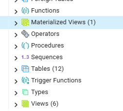

# Harjoitus 4: Tavalliset ja materialisoidut näkymät

**Harjoituksen sisältö** - Harjoituksessa tutustutaan eri tyyppisten näkymien luontiin ja käyttöön

**Harjoituksen tavoite** - Harjoituksen opiskelija osaa luoda ja muokata näkymää, ja hänellä on käsitys näkymien käyttötarkoituksesta.

### Valmistautuminen

Avaa [pgAdmin](/pgadmin) selaimeen ja kirjaudu sisään. Avaa **Query Tool** (Valitse *trainingdatabase* **-\>** Ylhäältä **Tools** **-\>** **Query Tool**).

## Harjoitus: tavallinen näkymä

Edellisessä harjoituksessa muodostimme kyselyn teiden varsilla olevien puiden löytämiseksi. Tehdään tämän perusteella uusi kysely, johon haluamme liittää kuhunkin 
tulokseen vielä tiedon siitä, missä kaupunginosassa puu on 

:::code-box
```sql
SELECT 
-- aiemmat puut + liitos kaupunginosaan, josta valitaan nimi
```
:::

<button onclick="toggleAnswer(this)" class="btn answer_btn">vinkki</button>

::: hidden-box
:::code-box
```sql
-- käytetään esimerkiksi common table expressionia
WITH teiden_puut AS (
    <Aiempi kysely>
)
SELECT teiden_puut.*, k.nimi_fi FROM teiden_puut
JOIN kaupunginosajako k
ON ...;
-- Millä ST-funktiolla spatiaalinen predikaatti, joka
-- palauttaa tosi kun puu tietyn kaupunginosan sisällä

```
:::
:::

<button onclick="toggleAnswer(this)" class="btn answer_btn">ratkaisu</button>

:::hidden-box
:::code-box
```sql
WITH teiden_puut AS (
    SELECT DISTINCT p.* FROM puurekisteri p
    JOIN liikennevaylat l 
    ON ST_DWithin(p.geom, l.geom, 5)
)
SELECT teiden_puut.*, k.nimi_fi FROM teiden_puut
JOIN kaupunginosajako k
ON ST_Within(teiden_puut.geom, k.geom);
```
:::
:::

Luodaan tämän kyselyn perusteella ensin varsinainen tietokantataulu seuraavalla tavalla:

:::code-box
```sql
CREATE TABLE IF NOT EXISTS tienvarren_puut AS (
<kysely>
);
```
:::

Luodaan tämän jälkeen vaihtoehtoisesti samasta kyselystä normaali näkymä syntaksilla:

:::code-box
```sql
CREATE OR REPLACE VIEW view_tienvarren_puut AS (
<kysely>
)
```
:::

Kumman luomiseen kului enemmän aikaa? Kumpi on nopeampi käytössä?


## Materialisoitu näkymä

Luo nyt vastaava näkymä materialisoituna, eli kyselyn palauttama data tallennetaan erikseen levylle tavallisen
taulun tapaan. Materialisoidun näkymän luomisen syntaksi on (vrt. syntaksia taulun ja tavallisen näkymän tapaukseen): 

:::code-box
```sql
CREATE MATERIALIZED VIEW IF NOT EXISTS <nimi> AS ();
```
:::


<button onclick="toggleAnswer(this)" class="btn answer_btn">ratkaisu</button>
:::hidden-box
:::code-box
```sql
CREATE MATERIALIZED VIEW IF NOT EXISTS mview_tienvarren_puut AS (
WITH teiden_puut AS (
    SELECT DISTINCT p.* FROM puurekisteri p
    JOIN liikennevaylat l 
    ON ST_DWithin(p.geom, l.geom, 5)
)
SELECT teiden_puut.*, k.nimi_fi FROM teiden_puut
JOIN kaupunginosajako k
ON ST_Within(teiden_puut.geom, k.geom)
);
```
:::
:::

- Huomasitko jälleen materialisoidun näkymän luomisen ja kyselyn suhteelliset kestot?

Nämä eri tyyppiset näkymät löytyvät pgAdminin valikosta eri valikkojen alta:



- Onko valikkojen alta löytyvissä kohteissa eroja?


## Näkymien muokkaus ja datan päivitys

Näkymät toimivat monin tavoin tavallisen tietokantataulun kaltaisesti, mutta siihen on valittu ja yhdistelty
sen luovalla SQL-kyselyllä kussakin tapauksessa relevantit tiedot. Kenties tietoja voisi myös kätevästi päivittää 
tätä kautta?

Testataan datan päivitystä kuhunkin tässä harjoituksessa luotuun näkymään:

:::code-box
```sql
UPDATE tienvarren_puut
SET kadunnimi = 'JOKUKATU'
WHERE fid = 1;
```
:::

:::code-box
```sql
UPDATE view_tienvarren_puut
SET kadunnimi = 'JOKUKATU'
WHERE fid = 1;
```
:::

:::code-box
```sql
UPDATE mview_tienvarren_puut
SET kadunnimi = 'JOKUKATU'
WHERE fid = 1;
```
:::

Huomataan ainakin, että:
- Taulun datan muokkaus, joten komento toimii
- Näkymiä ei voinut muokata, vaan se antoi virheen

Itse asiassa tavallisten näkymien täytyy toteuttaa useita ehtoja, jotta niiden dataa voisi suoraan 
muokata: ()[https://www.postgresql.org/docs/current/sql-createview.html]. Tähän palataan vielä seuraavassa 
harjoituksessa, mutta muokataan vielä samalla tavoin lähtötaulun dataa, ja tarkastellaan sen vaikutusta näkymiin.

:::code-box
```sql
UPDATE puurekisteri 
SET puistonnim = 'EI NIMEÄ'
WHERE puistonnim IS NULL;
```
:::

Tarkista nyt vastaavasti, mikä oli vaikutus kuhunkin tauluun ja näkymään:

:::code-box
```sql
SELECT * FROM tienvarren_puut WHERE puistonnim = 'EI NIMEÄ';
```
:::

:::code-box
```sql
SELECT * FROM view_tienvarren_puut WHERE puistonnim = 'EI NIMEÄ';
```
:::

:::code-box
```sql
SELECT * FROM mview_tienvarren_puut WHERE puistonnim = 'EI NIMEÄ';
```
:::


### Materialisoitujen näkymien päivitys


