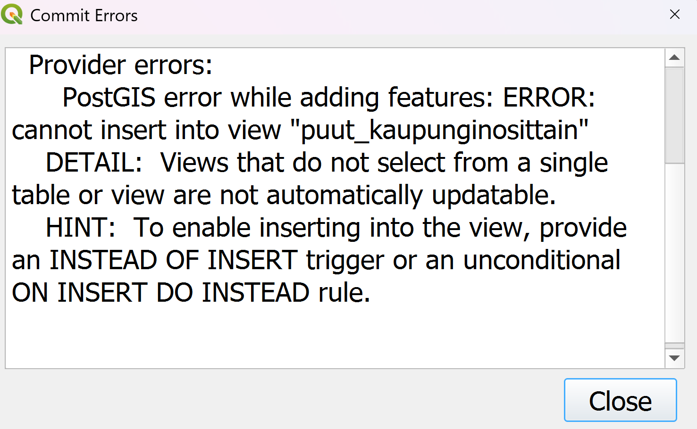

# Harjoitus 5: Triggerit ja niiden luonti

**Harjoituksen sisältö** - Harjoituksessa tutustutaan PostgreSQL:n triggereihin ja niiden määrittelyyn.

**Harjoituksen tavoite** - Harjoituksen jälkeen opiskelija tuntee PostGIS-geometrioiden käsittelyn perusteet.

### Valmistautuminen

Avaa [pgAdmin](/pgadmin) selaimeen ja kirjaudu sisään.  Avaa **Query Tool** (Valitse _trainingdatabase_ **->** Ylhäältä **Tools** **->** **Query Tool**).

## Harjoitus:

### Harjoitus: Triggeri näkymän päivittämiseen

Loimme aiemmassa harjoituksessa yksinkertaisen näkymän "puut_kaupunginosittain". Mikäli koitit muokata kohteita tämän näkymän kautta esimerkiksi pgAdminin 
tai QGISin kautta, tulit huomaamaan että muokkauksia tallentaessa (COMMIT) törmäsit virheeseen:

 

Tämä johtuu siitä, että näkymien päivittäminen edellyttää useamman ehdon täyttymistä (https://www.postgresql.org/docs/current/sql-createview.html, updatable views), 
ja ei onnistu suoraan, jos näkymä koostuu esim. tauluista joilla on liitoksia toisiin tauluihin. Sen sijaan tällaisille näkymille voidaan määritellä INSTEAD OF -tyyppinen
triggeri tiedon muokkaamista varten. Samaten, jos kohteita halutaan poistaa tai muokata näkymän kautta, täytyy näille operaatiolle luoda omat INSTEAD OF -tyyppiset triggerinsä.

- Luo triggeri olemassaolevan kohteen muokkaamiselle

Ensin pitää muodostaa ns. trigger-funktio, jonka syntaksi on muotoa 

:::code-box
```sql
CREATE OR REPLACE FUNCTION funktion_nimi()
RETURNS trigger AS $$
BEGIN
  <funktion runko>
  -- mitä triggerin halutaan tekevän
END;
$$ LANGUAGE plpgsql;

```
:::

<button onclick="toggleAnswer(this)" class="btn answer_btn">vinkki</button>

::: hidden-box
:::code-box
```sql
CREATE OR REPLACE FUNCTION puut_view_update()
RETURNS trigger AS $$
BEGIN
-- normaali SQL-syntaksi UPDATELLE
  UPDATE ...
  SET (..., ...) = (NEW.__, NEW.__)
  WHERE id = OLD.id;
  RETURN NEW;
END;
$$ LANGUAGE plpgsql;
```
:::
:::

<button onclick="toggleAnswer(this)" class="btn answer_btn">ratkaisu</button>

:::hidden-box
:::code-box
```sql
CREATE OR REPLACE FUNCTION puut_view_update()
RETURNS trigger AS $$
BEGIN
  UPDATE puurekisteri
  SET (geom, kadunnimi) = (NEW.geom, NEW.kadunnimi)
  WHERE id = OLD.id;

  RETURN NEW;
END;
$$ LANGUAGE plpgsql;
```
:::
:::

ja funktion luomisen jälkeen varsinainen triggeri, joka on muotoa

:::code-box
```sql
CREATE TRIGGER <nimi>
INSTEAD OF <operaatio> ON <taulu>
FOR EACH ROW
EXECUTE FUNCTION puut_view_update();
```
:::
<button onclick="toggleAnswer(this)" class="btn answer_btn">vinkki</button>

::: hidden-box
:::code-box
```sql
CREATE TRIGGER puut_update
INSTEAD OF UPDATE ON view_tienvarren_puut
FOR EACH ROW
EXECUTE FUNCTION puut_view_update();
```
:::
:::

<button onclick="toggleAnswer(this)" class="btn answer_btn">ratkaisu</button>

:::hidden-box
:::code-box
```sql
CREATE TRIGGER puut_update
INSTEAD OF UPDATE ON view_tienvarren_puut
FOR EACH ROW
EXECUTE FUNCTION puut_view_update();
```
:::
:::


Tässä siis luotiin toiminnallisuus joka päivittää puurekisteri-taulua jos joko
näkymän kohteen geometriaa tai kadunnimi-kenttää muokataan.  Voit halutessasi sisällyttää trigger-funktioon
myös muita kenttiä. Tarkista pgAdminin sivupaneelista tietokannan kohdalta, minne määritetyt funktio ja triggeri
tulevat näkyviin. Kokeile sitten näkymän kautta kohteen muokkaamista joko suoraan pgAdminissa tai vastaavaa 
QGISiin tuotua tasoa muokkaamalla.

- Entä, jos käyttäjä haluaa joko luoda uuden kohteen (INSTEAD OF INSERT) tai poistaa rivin (INSTEAD OF DELETE) näkymän kautta? Miten triggerin ja vastaavan funktion määrittely silloin kävisi? Yritä muodostaa näitä varten  kaksi uutta triggeriä ja funktiota.


## Trigger kenttien päivittämiseen

Tehdään vielä toinen triggeri ja triggeri-funktio, tällä kertaa liikennevaylat-tauluun. Taulussa on
mm. kentät "paivitetty" (date-tyyppiä) sekä "lisatietoj" (character varying (254)). Halutaan tehdä
triggeri joka päivittää nämä kentät automaattisesti riviltä jos tauluun lisätään uusi kohde tai 
olemassaolevaa muokataan. Kentän "paivitetty" triggerin pitäisi asettaa muokkauspäivä (CURRENT_DATE)
ja "lisatietoj" kenttään teksti 'tarkistettu'.

:::code-box
```sql
CREATE OR REPLACE FUNCTION liikennevaylat_update()
RETURNS trigger AS $$
BEGIN
  <funktion runko>
  -- mitä triggerin halutaan tekevän
END;
$$ LANGUAGE plpgsql;

```
:::

<button onclick="toggleAnswer(this)" class="btn answer_btn">vinkki</button>

::: hidden-box
:::code-box
```sql
CREATE OR REPLACE FUNCTION liikennevaylat_update()
RETURNS trigger AS $$
BEGIN
   NEW.___ := CURRENT_DATE;
   NEW.___ := ...;
   RETURN NEW;
END;
$$ LANGUAGE plpgsql;
```
:::
:::

<button onclick="toggleAnswer(this)" class="btn answer_btn">ratkaisu</button>

:::hidden-box
:::code-box
```sql
CREATE OR REPLACE FUNCTION liikennevaylat_update()
RETURNS trigger AS $$
BEGIN
    NEW.paivitetty := CURRENT_DATE;
    NEW.lisatietoj := 'tarkistettu';
    RETURN NEW;
END;
$$ LANGUAGE plpgsql;
```
:::
:::

:::code-box
```sql
CREATE OR REPLACE TRIGGER <nimi>
    BEFORE <operaatiot> ON <taulu>
    FOR EACH ROW
    EXECUTE FUNCTION <nimi>;
```
:::

<button onclick="toggleAnswer(this)" class="btn answer_btn">vinkki</button>

::: hidden-box
:::code-box
```sql
CREATE OR REPLACE TRIGGER trg_liikennevaylat_update
    BEFORE INSERT OR UPDATE ON liikennevaylat
    FOR EACH ROW
    EXECUTE FUNCTION liikennevaylat_update();
```
:::
:::

<button onclick="toggleAnswer(this)" class="btn answer_btn">ratkaisu</button>

:::hidden-box
:::code-box
```sql
CREATE OR REPLACE TRIGGER trg_liikennevaylat_update
    BEFORE INSERT OR UPDATE ON liikennevaylat
    FOR EACH ROW
    EXECUTE FUNCTION liikennevaylat_update();
```
:::
:::

- Testaa triggeriä muokkaamalla olemassa olevan liikennevaylan tietoja sekä luomalla uusia kohteita (kaikkia kenttiä ei tarvitse insertoida).
