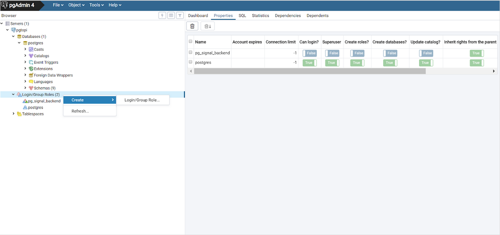

# Harjoitus 6: Käyttäjähallinta

**Harjoituksen sisältö** - Harjoitellaan käyttäjäroolien ja oikeuksien asettamista.

**Harjoituksen tavoite** - Harjoituksen jälkeen opiskelija tuntee 

### Valmistautuminen

Avaa [pgAdmin](/pgadmin) selaimeen ja kirjaudu sisään.  Avaa **Query Tool** (Valitse _trainingdatabase_ **->** Ylhäältä **Tools** **->** **Query Tool**).

## Harjoitus 6.1: Käyttäjäroolit

Oletusarvoisesti PostgreSQL:ään luodaan postgres-niminen rooli ja samanniminen tietokanta. Aiemmin harjoituksissa on luotu koulutusta varten tietokanta (trainingdatabase). Voit luoda uuden käyttäjän tietokantapalvelimeen seuraavalla SQL-komennolla:

:::code-box
```sql
DROP ROLE IF EXISTS matti;

CREATE ROLE
matti
LOGIN PASSWORD
'1234'
CREATEDB
VALID UNTIL
'infinity';
```
:::

**CREATEDB**-parametri määrittää roolille oikeudet tietokantojen luomiseen. VALID-parametri määrittää roolin voimassaolon ajan (tässä tapauksessa ikuisesti).

Luo uusi ylläpitäjän rooli seuraavalla SQL-komennolla:

:::code-box
```sql
DROP ROLE IF EXISTS dba;

CREATE ROLE
dba
LOGIN PASSWORD
'1234'
SUPERUSER
VALID UNTIL
'2024-1-1 00:00';
```
:::

Uudella roolilla on ylläpitäjän oikeudet (SUPERUSER) ja se on voimassa 1. tammikuuta 2024 asti.
Voit tarkastella käyttäjien tietoja pgAdminin puuhierarkian kohdassa **Login/Group Roles**.

## Harjoitus 6.2: Ryhmäroolit

Ryhmäroolit (group roles) luodaan seuraavalla SQL-komennolla:

:::code-box
```sql
DROP ROLE IF EXISTS admins;

CREATE ROLE
admins
INHERIT;
```
:::

INHERIT-parametri tarkoittaa sitä, että kaikki **our_admins**-ryhmän sisällä olevat roolit perivät ryhmän oikeudet. Poikkeuksena, **superuser**-oikeus ei koskaan periydy PostgreSQL:ssä.

Lisää roolit matti ja dpa ryhmään admins seuraavasti:

:::code-box
```sql
GRANT
admins
TO
matti, dba;
```
:::

Voit vaihtaa rooleja komennolla **SET ROLE**:

:::code-box
```sql
SET ROLE
matti;
```
:::

Käytössä olevan roolin voi tarkistaa komennolla:

::: code-box
```sql
SELECT current_user;
```
:::

Kokeile komentoa SELECT session_user.

:::code-box
```sql
SELECT ...
```
:::

:::hint-box
Mikä on current_user ja session_user välinen ero?
:::

## Harjoitus 6.3: Roolien lisääminen käyttöliittymässä



Roolien hallinta on selkeämpää pgAdminin käyttöliittymässä. Lisää uusi käyttäjä, valitse salasana ja lisää hänet myös admins-ryhmärooliin, huomaa SQL-välilehdelle muodostuva SQL-lauseke. Roolien poistaminen tapahtuu **DROP ROLE < roolin nimi >** -komennolla.