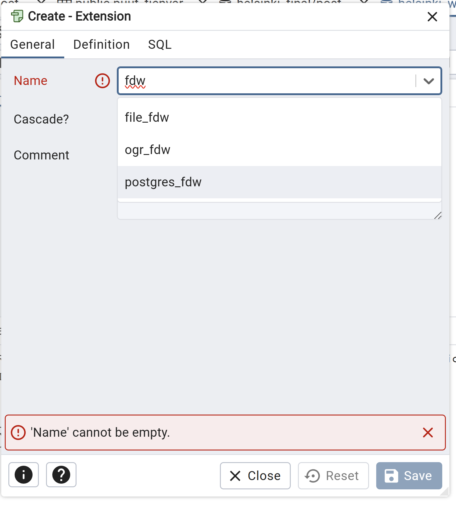

# Harjoitus 7: Foreign Data Wrapper ja yhteentoimivuus muiden ohjelmistojen kanssa

**Harjoituksen sisältö** - Harjoituksessa tutustutaan Postgresin FDW-ominaisuuteen ja miten sillä saadaan yhdistettyä tietokanta 
muihin tietokantoihin tai ulkoisiin datalähteisiin.

**Harjoituksen tavoite** - Harjoitusten jälkeen opiskelijalla on 

### Valmistautuminen

Avaa [pgAdmin](/pgadmin) selaimeen ja kirjaudu sisään.  Avaa **Query Tool** (Valitse _trainingdatabase_ **->** Ylhäältä **Tools** **->** **Query Tool**). Käytössä tulee olla myös web-selain, joka mahdollistaa pääsyn Maanmittauslaitoksen koordinaattien muunnospalveluun.


Jos koitat kysellä toisen tietokannan tauluista (kuten worlddatabase) esimerkiksi kyselyllä

:::code-box
```sql
SELECT * FROM populated_places;
```
:::

PostgreSQL palauttaa virheen ("ERROR:  cross-database references are not implemented"). Luodaan nyt 
foreign data wrapper, jotta voimme tuoda tämän "ulkoisen" tietokannan tiedot tietokantaan foreign tablen
muodossa. 

## Harjoitus 7.1: Foreign Data Wrapperin luominen

Foreign data wrapper (fdw) voidaan luoda myös pgAdminin käyttöliittymän kautta luomalla ensin vaadittava laajennos 
 
 

Tämän jälkeen määritettäisiin itse fdw, mutta ajetaan tässä suoraan nämävastaavat SQL-komennot.

:::code-box
```sql
CREATE EXTENSION postgres_fdw;
```
:::

Tämän jälkeen voidaan luoda ns. foreign server:

:::code-box
```sql
CREATE SERVER foreign_worlddata_server
    FOREIGN DATA WRAPPER postgres_fdw
    OPTIONS (host 'dbhost', port '5439', dbname 'worlddatabase');
```
:::

Lisäksi täytyy luoda käyttäjien mäppäys lokaalin ja ulkoisen tietokannan käyttäjien välillä:

:::code-box
```sql
CREATE USER MAPPING FOR <local_user>
        SERVER foreign_worlddata_server
        OPTIONS (user 'foreign_user', password 'password');
```
:::

Tämän jälkeen voidaan tuoda dataa paikalliseen tietokantaan ns. ulkoisena tauluna (foreign table).
Huomaa, että ulkoisen taulun kenttien tyyppien ja muiden ominaisuuksien pitää vastata datalähteen taulun 
vastaavia (lähtökohtaisesti myös kenttien nimien).

:::code-box
```sql
CREATE FOREIGN TABLE worlddata_foreign_table (
        id integer NOT NULL,
        geom geometry,
        name character varying(100)
)
        SERVER foreign__worlddata_server
        OPTIONS (schema_name 'public', table_name 'populated_places');
```
:::

Edellä sisällytettiin tauluun vain osa ulkoisen taulun kentistä, mutta voit ottaa niitä mukaan lisääkin. 
Tee alussa toiseen tietokantaan yritetty kysely nyt ulkoiseen tauluun:

:::code-box
```sql
SELECT * FROM worlddata_foreign_table;
```
:::

Koita yhdistää dataa paikallisten taulujen kanssa, tekemällä esimerkiksi liitoksia taulujen välille tai luomalla näkymän. 

Esimerkki:

:::code-box
```sql
SELECT * from worlddata_foreign_table A
JOIN kaupunginosajako B
ON ST_Intersects(ST_Transform(a.geom, 4326), b.geom)
```
:::

- Entä minkä kaupunginosan sisällä on worlddatan populated_places-taulun piste?

- Eroaako käyttö jollakin tavalla paikallisen tietokannan taulun tai näkymän käytöstä?

Koita vielä lopuksi muokata foreign tablea, esimerkiksi hae ensin

:::code-box
```sql
SELECT * FROM worlddata_foreign_table
WHERE name = 'Vatican City';
```
:::

jolloin varmistut että kyseinen rivi on olemassa, ja muokkaa sitten:

:::code-box
```sql
UPDATE worlddata_foreign_table 
SET name = 'Vatikaani'
WHERE name = 'Vatican City';
```
:::

Käy nyt varmistamassa että muokkaus todella muutti myös ulkoisen tietokannan alkuperäistä tauluna 
(mikäli ulkoisen käyttäjän oikeudet tähän riittivät). Valitse siis  _worlddata_ **->** Ylhäältä **Tools** **->** **Query Tool** ja aja

:::code-box
```sql
SELECT * FROM populated_places
WHERE name = 'Vatikaani';
```
:::

Voit vielä halutessasi muokata alkuperäisen worlddata-tietokannan taulua ja tarkistaa sen vaikutusta foreign tableen.

Voit ajan salliessa lisäksi tutustua myös asennuksen mukana tulleisiin muun tyyppisiin foreign data wrappereihin hakemalla
pgAdminin CREATE EXTENSION -kohdasta, kuten

- [file_fdw](https://www.postgresql.org/docs/current/file-fdw.html)
- ogr_fdw ym., [linkki](https://wiki.postgresql.org/wiki/Foreign_data_wrappers)
